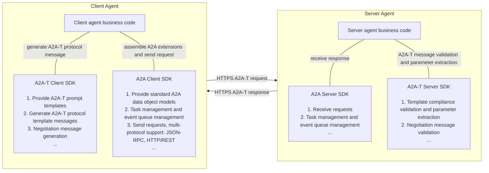
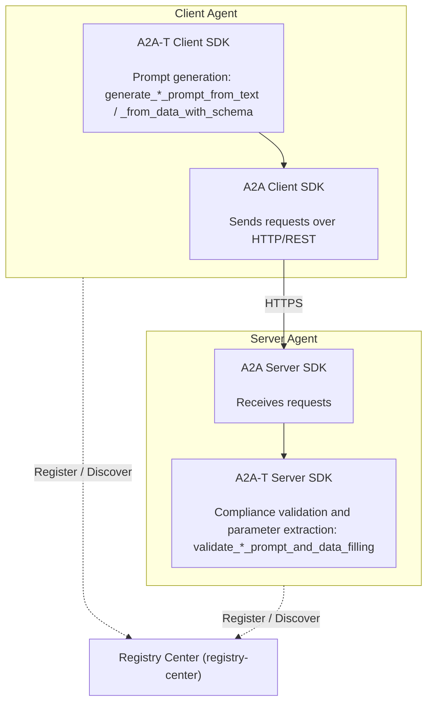
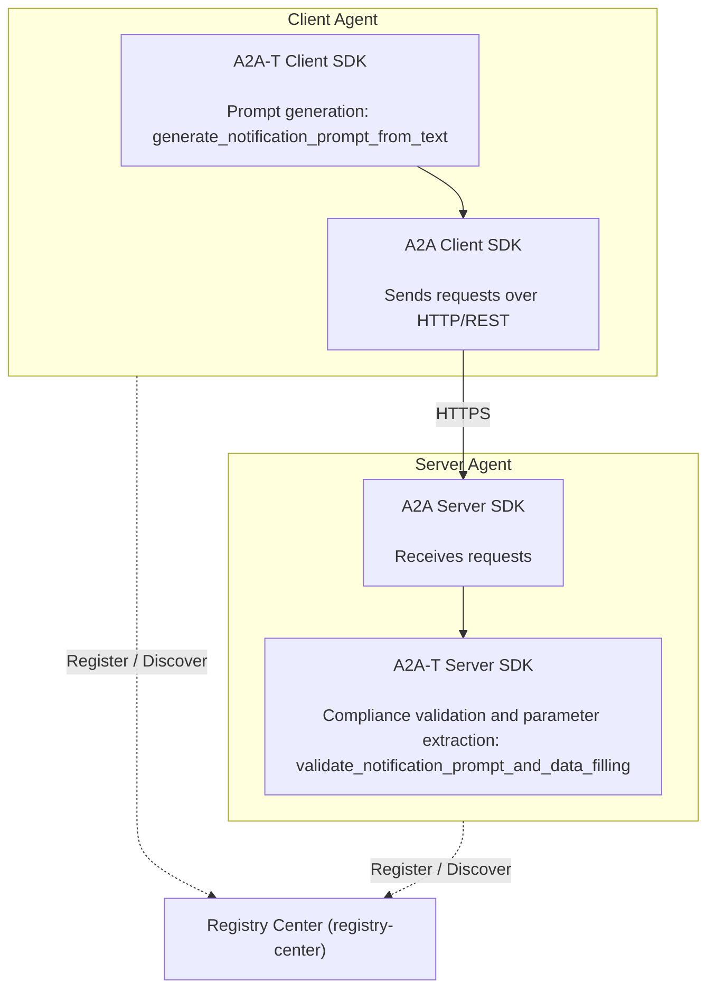

# 1 a2a-t-sdk-python Developer Guide

> SDK version: 1.1.0 — this release corresponds to the Java a2a-t-sdk 1.1.0 capability surface.

| Category       | Description                                                        |
| -------------- | ------------------------------------------------------------------ |
| Target readers | Developers, integration and deployment engineers, and project O&M personnel who build multi-agent protocol interactions based on the A2A-T SDK |
| Purpose        | This document describes the architecture, the complete API surface, the resource access layer, the error model, the development workflow, and the testing infrastructure of the A2A-T SDK, helping developers complete SDK integration, feature development, and extension quickly and consistently. |
| Prerequisites  | Familiar with the data model definitions and usage of the A2A multi-agent protocol, the AgentCard model definition and usage, and registry-center-related functions |

## 1.1 Feature Introduction

### 1.1.1 A2A-T Capabilities
A2A-T (Agent-to-Agent Telecom) is a multi-agent interconnection protocol for the telecom domain built on the A2A protocol, designed specifically for complex collaboration scenarios in the telecom domain.

General-purpose agent interconnection protocols in the industry mainly focus on agent interconnection and interaction frameworks, paying insufficient attention to business scenarios and specific interaction content, which results in a low task completion success rate. Business scenarios in the telecom domain are complex and demanding, so a dedicated protocol is required to support the interconnection and collaboration of O&M agents. Based on the A2A protocol, the A2A-T solution focuses on application extensions for enhanced capabilities such as information models, task negotiation, and collaboration security for telecom business flows.

a2a-t-sdk-python is a Python SDK for telecom agent collaboration scenarios. It is used to generate, validate, and negotiate task prompts in A2A-T interactions. The SDK is suitable for integration by client Agents, server Agents, and upper-layer orchestration systems.

Main capabilities include:

- **Task prompt generation**: the client generates A2A-T-conformant prompt messages from natural language (scenario recognition) or from text / structured input addressed to one explicit template.
- **Server-side prompt validation and parameter filling**: the server validates the A2A-T message submitted by the client against the scenario, template, and slot constraints, and extracts its parameters per a caller-provided schema.
- **Negotiation content API**: twelve methods over the Negotiation-T extension — eight message-generation methods (`generate_{propose,accept,reject,abort}_prompt_from_{data,text}`) and four message-validation methods (`validate_{propose,accept,reject,abort}_prompt_and_data_filling`).
- **Prompt resource management**: built-in scenario, slot, template, vocabulary, and system prompt resources with bilingual (zh-CN / en-US) coverage, plus local-file overrides of the business content.
- **LLM adaptation**: connects to external large language models through OpenAI-compatible APIs, with bounded retries for the retryable failure codes.
- **Structured, bilingual error model**: a closed catalog of 42 machine-readable error codes with fact parameters and bilingual message templates.

### 1.1.2 Relationship Between the A2A-T SDK and the A2A SDK

The A2A-T protocol is an extension of the A2A protocol. The A2A-T SDK is provided for the extended protocol content, supporting rapid construction of agents for complex collaboration scenarios in the telecom domain. The A2A-T SDK is independent of the A2A SDK. By integrating both the A2A-T SDK and the A2A SDK, you can build agents that support the A2A-T protocol, enabling deterministic, highly reliable, efficient, and secure collaboration among multiple agents in the telecom domain.



### 1.1.3 Typical Interaction Scenarios of the A2A-T SDK

A typical multi-agent collaboration interaction scenario involves at least three components: the client agent, the server agent, and the registry center.



When the task information carried by the first prompt is incomplete, the two agents switch to the negotiation flow: the server generates a Negotiation-T propose message asking for the missing information, the client validates it, fills the requested parameters, and answers with a Task-T prompt plus a Negotiation-T accept message. The complete closed loop is demonstrated by the offline sample under `a2a-t-sample/negotiation/` (see 1.6.6).

## 1.2 Constraints and Limitations

1. Python 3.12+ is required.
2. Complete multi-agent protocol interaction development additionally requires `a2a-sdk` version 1.1.0+.
3. The SDK is stateless: the negotiation session state travels in the A2A-T metadata (`negotiationContext`) of each message, never inside the SDK.
4. The legacy state-machine negotiation demo (`start_negotiation` / `receive_negotiation` / `continue_negotiation` and the `negotiation/{types,store,runtime,handling}` packages) is deprecated since 1.1.0 (a `DeprecationWarning` is emitted) and will be removed in the next release.
5. The A2A-T SDK does not provide an agent HTTP service framework, registry-center client, authentication, or key management capabilities; these must be integrated by the business system.

## 1.3 Environment Preparation

### 1.3.1 Environment Requirements

| Item                | Requirement                                                        |
| ------------------- | ------------------------------------------------------------------ |
| Python SDK          | Python 3.12+                                                       |
| Dependency management | `uv` recommended                                                 |
| LLM                 | An accessible OpenAI-compatible service and API key (not needed for the offline tests and sample) |
| Operating system    | Linux, Windows, and macOS are all suitable for development and integration testing |

### 1.3.2 Setting Up the Environment

Taking a Windows 11 64-bit amd64 development environment as an example:

**Install Python 3.12**

1. Official download link: https://www.python.org/ftp/python/3.12.10/python-3.12.10-amd64.exe

2. Run `python-3.12.10-amd64.exe` as administrator

3. **Make sure to check**: Add Python 3.12 to PATH

4. After installation, open a terminal and run the verification command:

   ```shell
   python --version
   # Expected output: Python 3.12.10
   ```

**Install uv**

1. After installing Python, install uv using pip. In a terminal, run: `python -m pip install uv`

2. After installation, run the verification command:

   ```shell
   uv --version
   # Expected output: uv 0.12.1 (329541a50 2026-07-31 x86_64-pc-windows-msvc)
   ```

3. Install the project dependencies and run the test suite:

   ```shell
   cd {project_path}/a2a-t-sdk-python
   uv sync --dev
   uv run pytest -q
   ```

## 1.4 Architecture Overview

### 1.4.1 Package Layout

The SDK is a single package (`src/a2a_t/`) whose runtime dependencies are intentionally limited to `jsonschema`, `python-dotenv`, and `openai`.

| Package | Responsibility |
| --- | --- |
| `a2a_t.core` | Cross-cutting foundations: template addressing (`template_uri`, `standard_templates`, `path_segments`, `prompt_resource_key`), the metadata model of generated messages (`metadata`), the shared content-validation pipeline (`validation_pipeline`), and the error model (`core/errors`: `catalog`, `messages`, `exceptions`, `input_limit`) |
| `a2a_t.common.prompt_resources` | The single resource access layer (see 1.7): `resource_access` routing, `packaged_access` (importlib.resources), `local_file_access` (frozen snapshot), `template_source`, `json_source`, `vocabulary`, plus the template catalog and query service (`catalog`) |
| `a2a_t.common.prompt_runtime` | Prompt runtime components shared by the prompt pipelines |
| `a2a_t.prompt` | The prompt pipeline: `analysis` (scenario recognition, slot extraction), `task_rendering` (`sectioned_renderer` with the two explicit rendering strategies, `task_prompt_renderer`), `validation` |
| `a2a_t.negotiation.content` | The typed content model of negotiation messages: frozen dataclasses (`models`), enums (`enums`), the vocabulary key contract (`vocabulary`), and the shared confirm-request validation (`confirm_request`) |
| `a2a_t.negotiation.generation` | The negotiation generation pipeline: `content_service` (the 12-method `NegotiationContentService`), `orchestrator`, `generators` (function generators + dispatch registry), `content_extractor` (LLM extraction leg), `message_builder`, `json_schema_builder` |
| `a2a_t.negotiation.validation` | The negotiation validation pipeline: `compliance_checker` (deterministic rule gate), `semantic_validator` (LLM semantic gate), `param_extractor` (delegates to the core `ValidationPipeline`) |
| `a2a_t.negotiation.resources` | The `NegotiationReference` domain type (template addressing of negotiation types); no IO — resource loading goes through the common layer |
| `a2a_t.client` | The `A2ATClient` facade and its prompt-generation / negotiation orchestrators |
| `a2a_t.server` | The `A2ATServer` facade and its prompt-compliance / negotiation orchestrators |
| `a2a_t.config` | `.env`-based configuration: `source` (explicit-path dotenv), `models` (`A2ATConfig`, `PromptRuntimeConfig`, `LlmRuntimeConfig`) |
| `a2a_t.llm` | LLM adaptation: the `LLMClient` protocol, the factory with provider registration, the OpenAI-compatible provider, and config loading |
| `a2a_t.prompt_resources` | The packaged resource data tree: `templates/`, `slots/`, `scenarios/`, `negotiation-vocabulary/`, `prompts/`, `errors/` |

The legacy demo packages `a2a_t.negotiation.{types,store,runtime,handling,rendering,common}` are deprecated (see 1.2) and must not be used by new code.

### 1.4.2 Design Invariants

Three invariants hold across the whole SDK and are pinned by tests:

1. **One resource access layer.** Both the prompt pipeline and the negotiation pipeline read resources exclusively through `a2a_t.common.prompt_resources.resource_access`; no other module may assemble resource paths or own a resource cache.
2. **One error catalog.** Every business failure carries a code from the closed `ErrorCatalog`; codes returned by an LLM step that are not in the catalog are mapped to the per-domain `*.rule_violation` fallback members and never surfaced raw.
3. **A stateless SDK.** Negotiation session state lives in the message metadata (`negotiationContext`), so both facades can serve any number of sessions without server-side storage.

## 1.5 API Surface Overview

### 1.5.1 A2ATClient

| Method | Description |
| --- | --- |
| `generate_task_prompt(user_input)` | Scenario-recognition entry point; returns a `PromptGenerationResult` (result track) |
| `generate_{task,auth,notification}_prompt_from_text(text, template_uri)` | Generate a prompt for the addressed template from natural language; one LLM slot-extraction step, then deterministic rendering; returns `MetadataContent` |
| `generate_{task,auth,notification}_prompt_from_data_with_schema(data, schema, template_uri)` | Same as above from structured input plus a field-description schema; returns `MetadataContent` |
| `generate_negotiation_{propose,accept,reject,abort}_prompt_from_data(data, template_uri)` | Deterministic negotiation message generation from typed content (zero LLM calls); returns `MetadataContent` |
| `generate_negotiation_{propose,accept,reject,abort}_prompt_from_text(text, context, template_uri)` | Negotiation message generation from free text; one retryable LLM content-extraction step; returns `MetadataContent` |
| `validate_{propose,accept,reject,abort}_prompt_and_data_filling(prompt, context, schema, template_uri)` | Validate a negotiation message and extract its parameters; returns `FilledParamData` |
| `get_prompts()` / `get_prompt(template_uri)` | Extension-agnostic template queries; never throw for well-formed URIs |
| `start_negotiation` / `receive_negotiation` / `continue_negotiation` | Deprecated legacy state-machine demo; emits a `DeprecationWarning` |

### 1.5.2 A2ATServer

The server facade exposes the same twelve negotiation methods and the same template queries, plus its own validation surface:

| Method | Description |
| --- | --- |
| `check_task_prompt(*, processed_prompt_text)` | Scenario/template/slot compliance check of a processed task prompt; returns a `PromptComplianceResult` (result track) |
| `validate_{task,notification,auth}_prompt_and_data_filling(prompt, schema, template_uri)` | Validate a rendered prompt of the addressed extension against a caller-provided parameter JSON schema and extract the parameters; returns `FilledParamData` |
| `generate_negotiation_*` / `validate_{propose,accept,reject,abort}_prompt_and_data_filling` / `get_prompts` / `get_prompt` | Identical to the client surface (both facades share one `NegotiationContentService` and one `TemplateQueryService`) |
| `start_negotiation` / `receive_negotiation` / `continue_negotiation` | Deprecated legacy state-machine demo |

### 1.5.3 Shared Data Types

- `MetadataContent` (`a2a_t.core.metadata`) — the successful generation result: `template_uri`, `prompt_text`, `extension_uri`, and the optional `negotiation_context`; `build_metadata_content()` produces the ready-to-use A2A-T metadata map (extension URI → prompt text, plus `templateUri` and, for negotiation messages, `negotiationContext`).
- `NegotiationContext` / `NegotiationPerformative` (`a2a_t.core.metadata`) — the session context (`id` UUID, `round`, `max_rounds`, `performative`); immutable, with `next_round()` / `with_performative()` deriving new instances.
- `FilledParamData` (`a2a_t.core.validation_pipeline`) — the parameter-extraction result: `data` maps parameter names to extracted values.
- `PromptGenerationResult` / `PromptGenerationFailure` and `PromptComplianceResult` / `PromptComplianceFailure` — the result-track dataclasses carrying `success` and the structured `failure` (`code` / `message` / `stage`).
- `PromptTemplate` (`a2a_t.common.prompt_resources`) — one loadable template: `template_uri`, `description`, `content`, and `source` (`packaged` or `local`).

Both facades parse the `template_uri` boundary fail-fast: `None` raises `TypeError`, a blank or malformed URI (fewer than three segments, or a segment that is not a simple path segment) raises `ValueError` with the message `Unparseable template URI: <input>`.

## 1.6 Basic Development Sample

### 1.6.1 System Architecture

A basic multi-agent collaboration interaction flow involves at least three components: a client Agent, a server Agent, and a registry center.



### 1.6.2 Sample API Description

This basic development sample mainly uses the following two A2A-T SDK APIs. In actual development, select the appropriate APIs based on your business requirements:

**1. A2A-T Client SDK**

API definition and function description: generates a notification subscription prompt message from natural-language text with the specified Notification-T template (skipping scenario recognition). It runs one LLM slot-extraction step and then renders the template deterministically; the generation phase performs built-in slot schema validation.

```python
def generate_notification_prompt_from_text(self, text: str, template_uri: str | TemplateUri) -> MetadataContent
```

Sample call:

```python
from pathlib import Path

from a2a_t.client.a2at_client import A2ATClient

client = A2ATClient(env_path=Path("package_data/.env"))

metadata = client.generate_notification_prompt_from_text(
    "Generate an Incident event subscription task: the notification topic is Incident, "
    "the subscription levels are critical, medium, high, and low, and the notification data "
    "format is DataPart",
    "Notification-T/network-layer/subscribe-incident/v1",
)

print(metadata.prompt_text)              # the rendered prompt message
print(metadata.build_metadata_content()) # the A2A-T metadata map ready to send

"""Output of the generated notification subscription prompt message (metadata.prompt_text; the
actual text varies with the LLM slot-extraction result):
## Subscription Description
Based on the following <Notification Topic>, <Subscribe Condition>, <Notification Data Format>, and <Expected Output> information, complete the network-side intelligent fault Incident subscription and reporting task.

## Notification Topic
The name of this topic is "Incident"

## Subscribe Condition
Fault levels are "critical", "medium", "high", "low"

## Notification Data Format
Report Incident data via DataPart

## Expected Output
1. Subscription result, success or failure
2. Reason for subscription failure (optional)
"""
```

**2. A2A-T Server SDK**

API definition and function description: validates whether a Notification-T notification subscription prompt message matches the template and slot constraints, and extracts parameters (subscription topic, subscription condition, notification data format, etc.) per the caller's schema.

```python
def validate_notification_prompt_and_data_filling(
    self,
    prompt: str,
    schema: Mapping[str, object],
    template_uri: str | TemplateUri,
) -> FilledParamData
```

Sample call: validates the notification subscription message sent by the client and extracts the subscription parameters

```python
from pathlib import Path

from a2a_t.server.a2at_server import A2ATServer

server = A2ATServer(env_path=Path("package_data/.env"))

validation_schema = {
    "type": "object",
    "properties": {
        "topic": {
            "type": "string",
            "description": "Subscription topic (required). The name of the event topic to subscribe to.",
        },
        "subscriptionCondition": {
            "type": "string",
            "description": "Subscription condition (optional). The description of the condition to subscribe to.",
        },
        "notificationDataFormat": {
            "type": "string",
            "description": "Notification data format (required). The description of the notification data format to report.",
        },
    },
    "required": ["topic", "notificationDataFormat"],
}

# prompt_text is the text of the notification subscription prompt message generated by the client
filled = server.validate_notification_prompt_and_data_filling(
    metadata.prompt_text, validation_schema, "Notification-T/network-layer/subscribe-incident/v1"
)

print(filled.data)
# Extracted subscription parameters per the schema, e.g.
# {'topic': 'Incident', 'subscriptionCondition': '', 'notificationDataFormat': 'DataPart'}
```

The counterpart compliance-only API `check_task_prompt(processed_prompt_text=...)` returns a `PromptComplianceResult` whose `failure` carries `code` / `message` / `stage` on rejection; the two can be combined — compliance first, parameter filling once compliance passes.

### 1.6.3 Development Flow

- Client development flow:

```mermaid
flowchart LR
    Install dependencies --> Configure the LLM --> Initialize the A2A-T client --> Initialize the AgentCard --> AgentCard registration and discovery --> Generate the A2A-T template message --> Fill in the A2A-T request headers --> Send the request with A2A-T extensions
```

- Server development flow:

```mermaid
flowchart LR
    Install dependencies --> Configure the LLM --> Initialize the A2A-T server --> Initialize the AgentCard --> AgentCard registration and discovery --> Receive and validate the message --> Internal business logic processing --> Fill in the A2A response headers --> Return the response
```

### 1.6.4 Sample Client Development Steps

#### 1.6.4.1 Install Dependencies

```bash
# A2A-T SDK
pip install a2a-t-sdk

# Official A2A Python SDK
pip install a2a-sdk
```

> Request sending, response consumption, and server-side route assembly use the official `a2a-sdk` (whose transport layer depends on `httpx`). The registry center is outside the scope of the official SDK; this guide interacts with it directly using `httpx`, which business systems can replace with `requests` or any other HTTP client. Starting the HTTP service on the server side additionally requires `uvicorn`:
>
> ```bash
> pip install uvicorn
> ```

#### 1.6.4.2 Configure the LLM

Copy the content of the repository-root `env.example` into `package_data/.env` (the default read location of the facades) and configure it as follows:

```properties
A2AT_LANGUAGE=en-US
A2AT_PROMPT_SOURCE_TYPE=packaged
A2AT_PROMPT_COMPLIANCE_ENABLED=true
A2AT_INPUT_TEXT_MAX_CHARS=16384
A2AT_LLM_PROVIDER=openai
A2AT_LLM_MODEL=deepseek-chat
A2AT_LLM_API_KEY={your_llm_api_key}
A2AT_LLM_BASE_URL=https://api.deepseek.com
A2AT_LLM_MAX_ATTEMPTS=3
```

> `A2AT_LLM_API_KEY` is the key used to **call the external large language model**. Keep it safe.
>
> The SDK connects to external LLMs through OpenAI-compatible APIs. `A2AT_LLM_PROVIDER` currently only supports `openai`. To access DeepSeek or other OpenAI-compatible services, specify the service address via `A2AT_LLM_BASE_URL` and the model name via `A2AT_LLM_MODEL`.
>
> Since 1.1.0 the default of `A2AT_PROMPT_SOURCE_TYPE` is `packaged` (the pre-1.1.0 default was `local_file`); see 1.7 and 1.12 for the resource source semantics and the migration path.

#### 1.6.4.3 Initialize the A2A-T Client

```python
from pathlib import Path
from a2a_t.client.a2at_client import A2ATClient

client = A2ATClient(env_path=Path("package_data/.env"))
```

Both `A2ATClient` and `A2ATServer` accept an `env_path` argument; when omitted, `package_data/.env` is read by default.

#### 1.6.4.4 Initialize the AgentCard

Reference client sample AgentCard definition:

> The supported A2A-T templates can be declared in `extensions`.

```json
{
  "agentCards": [
    {
      "name": "Transmission workbench agent",
      "description": "Transmission network O&M management agent that provides capabilities such as circuit recovery verification, base station outage root cause analysis, and network element hidden danger inspection",
      "supportedInterfaces": [
        {
          "url": "http://10.xx.xx.xx:26335/a2a/v1",
          "protocolBinding": "HTTP+JSON",
          "protocolVersion": "1.0"
        }
      ],
      "provider": {
        "organization": "ZzNode"
      },
      "version": "1.0.0",
      "capabilities": {
        "streaming": true,
        "pushNotifications": false,
        "extensions": [
          {
            "uri": "https://projects.tmforum.org/a2aproject/telecommunication/extensions/Task-T/v1",
            "description": "Extension of structured prompt Task-T requests."
          },
          {
            "uri": "https://projects.tmforum.org/a2aproject/telecommunication/extensions/Notification-T/v1",
            "description": "Extension of structured prompt Notification-T requests."
          }
        ],
        "extendedAgentCard": false
      },
      "securitySchemes": {
        "bearerAuth": {
          "httpAuthSecurityScheme": {
            "description": "Query the accessSession through the login interface using the user name and password, then use the accessSession for bearer authentication.",
            "scheme": "Bearer"
          }
        }
      },
      "defaultInputModes": [
        "application/json",
        "text/plain"
      ],
      "defaultOutputModes": [
        "application/json",
        "text/plain"
      ],
      "skills": [
        {
          "id": "ne-hidden-danger",
          "name": "NE hidden danger inspection agent",
          "description": "Network element hidden danger inspection skill. Inspects whether the specified network element still has new hidden dangers based on the input NE name.",
          "tags": [
            "NE inspection",
            "hidden danger inspection",
            "NE-inspection"
          ],
          "examples": [
            "Please inspect whether NE QZHA-HAZBYSDGG-HRHH still produces new hidden dangers"
          ],
          "inputModes": [
            "application/json",
            "text/plain"
          ],
          "outputModes": [
            "application/json",
            "text/plain"
          ]
        }
      ]
    }
  ]
}
```

AgentCards are stored in the registry center as JSON. When constructing the official A2A client or assembling server-side routes, convert the JSON into the official SDK's `a2a.types.AgentCard` object:

```python
from a2a.types import AgentCard
from google.protobuf.json_format import ParseDict

agent_card = ParseDict(agent_card_dict, AgentCard())
```

#### 1.6.4.5 AgentCard Registration and Discovery

- **AgentCard registration**: Publish the client AgentCard to the registry center. The registry center address and URI depend on the actual deployment.

```python
import httpx

AGENT_CARD = {...}  # AgentCard JSON defined in 1.6.4.4

def register_agent_card(registry_url: str, agent_card: dict) -> None:
    resp = httpx.post(
        registry_url,
        json=agent_card,
        timeout=10,
    )
    resp.raise_for_status()
```

- **AgentCard discovery**: Query the registry center by target Agent name or skill to obtain its AgentCard, which provides the `url` and supported skills.

```python
import httpx

def discover_agent(discover_url: str, task: str) -> dict:
    resp = httpx.post(
        discover_url,
        params={"task": task},
        timeout=10,
    )
    resp.raise_for_status()
    return resp.json()["agentCards"][0]
```

#### 1.6.4.6 Generate the A2A-T Template Message

The client uses the A2A-T Client SDK API to generate a `MetadataContent`, then sends its prompt text and template URI as part of the A2A message metadata:

```python
from pathlib import Path
from a2a_t.client.a2at_client import A2ATClient
from a2a_t.core.standard_templates import SUBSCRIBE_INCIDENT_URI

client = A2ATClient(env_path=Path("package_data/.env"))

metadata = client.generate_notification_prompt_from_text(
    "Generate an Incident event subscription task: the notification topic is Incident, "
    "the subscription levels are critical, medium, high, and low, and the notification data "
    "format is DataPart",
    SUBSCRIBE_INCIDENT_URI,
)

processed_prompt = metadata.prompt_text
a2at_metadata = metadata.build_metadata_content()
```

#### 1.6.4.7 Fill In A2A-T Request Headers

The A2A protocol conveys the protocol version and extension declarations through HTTP headers. Use the following headers:

| Header           | Direction        | Required                            | Value                                                                  |
| ---------------- | ---------------- | ----------------------------------- | ---------------------------------------------------------------------- |
| `A2A-Version`    | Request header   | Yes                                 | Protocol version, e.g. `1.0` (the client must include it in every request) |
| `A2A-Extensions` | Request header   | No (recommended when using extensions) | Comma-separated list of extension URIs, declaring the extensions used by this request |

When using the official A2A Client, request headers are passed in through `ClientCallContext.service_parameters` (the key-value pairs are sent as HTTP request headers), and protocol headers such as `A2A-Version` are attached automatically by the official client:

```python
from a2a.client.client import ClientCallContext

NOTIFICATION_PROMPT_EXT = "https://projects.tmforum.org/a2aproject/telecommunication/extensions/Notification-T/v1"

ACCESS_TOKEN = "{your_access_token}"

context = ClientCallContext(
    service_parameters={
        "A2A-Extensions": NOTIFICATION_PROMPT_EXT,
        "Authorization": f"Bearer {ACCESS_TOKEN}",
    },
)
```

#### 1.6.4.8 Send a Request with A2A-T Extensions

Create the A2A client with the official `ClientFactory`, build the request with `SendMessageRequest` (the A2A-T prompt is placed in `message.metadata`, keyed by the extension URI), and declare the extension request headers through `ClientCallContext`:

```python
import uuid

from a2a.client.client import ClientCallContext, ClientConfig
from a2a.client.client_factory import ClientFactory
from a2a.types import AgentCard, Role, SendMessageRequest
from a2a.utils.constants import TransportProtocol

from pathlib import Path
from a2a_t.client.a2at_client import A2ATClient
from google.protobuf.json_format import ParseDict

NOTIFICATION_PROMPT_EXT = "https://projects.tmforum.org/a2aproject/telecommunication/extensions/Notification-T/v1"

ACCESS_TOKEN = "{your_access_token}"

# 1) Generate the A2A-T prompt (see 1.6.4.6)
client = A2ATClient(env_path=Path("package_data/.env"))
metadata = client.generate_notification_prompt_from_text(
    "Generate an Incident event subscription task: the notification topic is Incident, "
    "the subscription levels are critical, medium, high, and low, and the notification data "
    "format is DataPart",
    "Notification-T/network-layer/subscribe-incident/v1",
)

# 2) Create the official A2A client (the AgentCard comes from the registry center; see 1.6.4.5)
agent_card = ParseDict(agent_card_dict, AgentCard())
a2a_client = ClientFactory(
    ClientConfig(
        supported_protocol_bindings=[TransportProtocol.HTTP_JSON],
        use_client_preference=True,
    )
).create(agent_card)

# 3) Build the request (headers declare the extension; the body carries the A2A-T metadata)
request = SendMessageRequest()
request.message.message_id = str(uuid.uuid4())
request.message.role = Role.ROLE_USER
request.message.parts.add().text = "Create an intelligent fault Incident reporting task"
for key, value in metadata.build_metadata_content().items():
    request.message.metadata[key] = str(value)

context = ClientCallContext(
    service_parameters={
        "A2A-Extensions": NOTIFICATION_PROMPT_EXT,
        "Authorization": f"Bearer {ACCESS_TOKEN}",
    },
)

# 4) Send the request and consume the response stream (StreamResponse: status_update / artifact_update / message)
async for stream_response in a2a_client.send_message(request, context=context):
    if stream_response.HasField("status_update"):
        print("status:", stream_response.status_update.status.state)
    elif stream_response.HasField("artifact_update"):
        print("artifact:", stream_response.artifact_update.artifact.name)
    elif stream_response.HasField("message"):
        print("message:", stream_response.message.parts[0].text)

await a2a_client.close()
```

#### 1.6.4.9 Complete Sample Client Code

```python
import asyncio
import uuid
from pathlib import Path

import httpx
from a2a.client.client import ClientCallContext, ClientConfig
from a2a.client.client_factory import ClientFactory
from a2a.types import AgentCard, Role, SendMessageRequest
from a2a.utils.constants import TransportProtocol
from a2a_t.client.a2at_client import A2ATClient
from google.protobuf.json_format import ParseDict

NOTIFICATION_PROMPT_EXT = "https://projects.tmforum.org/a2aproject/telecommunication/extensions/Notification-T/v1"

ACCESS_TOKEN = "{your_access_token}"

AGENT_CARD = {...}  # AgentCard JSON defined in 1.6.4.4

def register_agent_card(registry_url: str, agent_card: dict) -> None:
    resp = httpx.post(
        registry_url,
        json=agent_card,
        timeout=10,
    )
    resp.raise_for_status()

def discover_agent(discover_url: str, task: str) -> dict:
    resp = httpx.post(
        discover_url,
        params={"task": task},
        timeout=10,
    )
    resp.raise_for_status()
    return resp.json()["agentCards"][0]

async def main() -> None:
    # 1) Register the client AgentCard and discover the server AgentCard
    #    (the registry center is a business-system-side component)
    register_agent_card("{ip:port}/rest/v1/registry-center/agent-cards", AGENT_CARD)
    agent_card_dict = discover_agent("{ip:port}/rest/v1/registry-center/agent-cards/semantic-query", task="Need to subscribe to faults")

    # 2) Use the SDK to generate the A2A-T prompt
    client = A2ATClient(env_path=Path("package_data/.env"))
    metadata = client.generate_notification_prompt_from_text(
        "Generate an Incident event subscription task: the notification topic is Incident, "
        "the subscription levels are critical, medium, high, and low, and the notification data "
        "format is DataPart",
        "Notification-T/network-layer/subscribe-incident/v1",
    )

    # 3) Create the official A2A client
    agent_card = ParseDict(agent_card_dict, AgentCard())
    a2a_client = ClientFactory(
        ClientConfig(
            supported_protocol_bindings=[TransportProtocol.HTTP_JSON],
            use_client_preference=True,
        )
    ).create(agent_card)

    # 4) Build the request (headers declare the extension; the body carries the A2A-T metadata)
    request = SendMessageRequest()
    request.message.message_id = str(uuid.uuid4())
    request.message.role = Role.ROLE_USER
    request.message.parts.add().text = "Create an intelligent fault Incident reporting task"
    for key, value in metadata.build_metadata_content().items():
        request.message.metadata[key] = str(value)

    context = ClientCallContext(
        service_parameters={
            "A2A-Extensions": NOTIFICATION_PROMPT_EXT,
            "Authorization": f"Bearer {ACCESS_TOKEN}",
        },
    )

    # 5) Send the request and consume the response stream
    async for stream_response in a2a_client.send_message(request, context=context):
        if stream_response.HasField("status_update"):
            print("status:", stream_response.status_update.status.state)
        elif stream_response.HasField("artifact_update"):
            print("artifact:", stream_response.artifact_update.artifact.name)
        elif stream_response.HasField("message"):
            print("message:", stream_response.message.parts[0].text)

    await a2a_client.close()

asyncio.run(main())
```

### 1.6.5 Sample Server Development Steps

#### 1.6.5.1 Prerequisites

Steps such as installing dependencies, configuring the LLM, initializing the AgentCard, and AgentCard registration and discovery can be found in the [client implementation](#1641-install-dependencies). The differences are as follows:

- Initialize the A2A-T server

```python
from pathlib import Path
from a2a_t.server.a2at_server import A2ATServer

server = A2ATServer(env_path=Path("package_data/.env"))
```

- Initialize the AgentCard. Reference server sample AgentCard definition:

```json
{
  "agentCards": [
    {
      "name": "RAN Domain Agent",
      "description": "RAN Domain Agent",
      "provider": {
        "organization": "Huawei",
        "url": "https://www.huawei.com"
      },
      "version": "1.0.0",
      "capabilities": {
        "streaming": true,
        "pushNotifications": false,
        "extendedAgentCard": false,
        "extensions": [
          {
            "description": "Extension of structured prompt TASK-T requests.",
            "required": false,
            "uri": "https://projects.tmforum.org/a2aproject/telecommunication/extensions/Task-T/v1"
          },
          {
            "description": "Extension of structured prompt Notification-T requests.",
            "required": false,
            "uri": "https://projects.tmforum.org/a2aproject/telecommunication/extensions/Notification-T/v1"
          }
        ]
      },
      "defaultInputModes": [
        "application/json",
        "text/plain"
      ],
      "defaultOutputModes": [
        "application/json",
        "text/plain"
      ],
      "skills": [
        {
          "id": "ran-incident-subscription",
          "name": "Incident Reporting",
          "description": "Supports Incident reporting and provides intelligent fault identification and diagnosis capabilities",
          "tags": [
            "Incident Reporting"
          ],
          "examples": [
            "## Subscription Description\nBased on the following <Notification Topic>, <Subscribe Condition>, <Notification Data Format>, and <Expected Output> information, complete the network-side intelligent fault Incident subscription and reporting task.\n## Notification Topic\nThe name of this topic is \"Incident\"\n## Subscribe Condition\nFault level is \"high\"\n## Notification Data Format\nReport Incident data via DataPart\n## Expected Output\n1. Subscription result, success or failure\n2. Reason for subscription failure (optional)"
          ],
          "inputModes": [
            "application/json",
            "text/plain"
          ],
          "outputModes": [
            "application/json",
            "text/plain"
          ]
        }
      ],
      "securitySchemes": {
        "bearerAuth": {
          "httpAuthSecurityScheme": {
            "scheme": "Bearer",
            "description": "Query the accessSession through the login interface using the user name and password, then use the accessSession for bearer authentication."
          }
        }
      },
      "securityRequirements": [],
      "supportedInterfaces": [
        {
          "protocolBinding": "JSONRPC",
          "url": "https://10.xx.xx.xx:27417/a2a/v1",
          "tenant": "",
          "protocolVersion": "1.0"
        },
        {
          "protocolBinding": "HTTP+JSON",
          "url": "https://10.xx.xx.xx:27417/a2a/json",
          "tenant": "",
          "protocolVersion": "1.0"
        }
      ]
    }
  ]
}
```

#### 1.6.5.2 Receive and Validate the Message

The official A2A Server invokes business logic through the `AgentExecutor` callback. In the `execute` callback: first validate the extension request headers declared by the client from the `RequestContext`, then extract the processed task prompt from `message.metadata` (keyed by the extension URI), pass it to `A2ATServer.check_task_prompt` for the compliance check and to `validate_notification_prompt_and_data_filling` for parameter extraction, and finally push task statuses to the `EventQueue` according to the validation result:

```python
import uuid

from a2a.server.agent_execution.agent_executor import AgentExecutor
from a2a.server.agent_execution.context import RequestContext
from a2a.server.events.event_queue import EventQueue
from a2a.types import Artifact, Message, Role, Task, TaskState, TaskStatus, TaskStatusUpdateEvent
from google.protobuf.json_format import MessageToDict, ParseDict
from google.protobuf.struct_pb2 import Value

from pathlib import Path
from a2a_t.core.errors.exceptions import ContentValidationError
from a2a_t.server.a2at_server import A2ATServer

NOTIFICATION_PROMPT_EXT = "https://projects.tmforum.org/a2aproject/telecommunication/extensions/Notification-T/v1"
NOTIFICATION_TEMPLATE_URI = "Notification-T/network-layer/subscribe-incident/v1"

PARAM_SCHEMA = {
    "type": "object",
    "properties": {
        "topic": {"type": "string", "description": "Subscription topic (required)"},
        "notificationDataFormat": {"type": "string", "description": "Notification data format (required)"},
    },
    "required": ["topic", "notificationDataFormat"],
}

class NotificationAgentExecutor(AgentExecutor):
    """Server-side executor that handles Notification-T extension requests."""

    def __init__(self, prompt_server: A2ATServer) -> None:
        self._prompt_server = prompt_server

    async def execute(self, context: RequestContext, event_queue: EventQueue) -> None:
        task_id = context.task_id or ""
        context_id = context.context_id or ""

        # 1) Validate the A2A-T extension declared by the client (A2A-Extensions request header)
        if NOTIFICATION_PROMPT_EXT not in context.requested_extensions:
            raise ValueError("missing Notification-T extension")

        # 2) Extract the processed task prompt from message.metadata
        if context.message is None or context.message.metadata is None:
            raise ValueError("missing A2A-T task prompt")
        processed_prompt = str(MessageToDict(context.message.metadata).get(NOTIFICATION_PROMPT_EXT, ""))

        # 3) Push the SUBMITTED status
        task = Task(
            id=task_id,
            context_id=context_id,
            status=TaskStatus(
                state=TaskState.TASK_STATE_SUBMITTED,
                message=self._build_message(task_id, context_id, "subscription accepted"),
            ),
        )
        context.current_task = Task()
        context.current_task.CopyFrom(task)
        await event_queue.enqueue_event(task)

        # 4) Use the A2A-T SDK to validate completeness (compliance check, result track)
        check_result = self._prompt_server.check_task_prompt(processed_prompt_text=processed_prompt)
        if not check_result.success:
            # Validation failed: push REJECTED (failure carries code, message, and stage)
            await self._emit_status(event_queue, task_id, context_id, TaskState.TASK_STATE_REJECTED, f"prompt validation failed: {check_result.failure}")
            return

        # 5) Validation passed: extract the subscription parameters (raising track)
        try:
            filled = self._prompt_server.validate_notification_prompt_and_data_filling(
                processed_prompt, PARAM_SCHEMA, NOTIFICATION_TEMPLATE_URI
            )
        except ContentValidationError as exc:
            await self._emit_status(event_queue, task_id, context_id, TaskState.TASK_STATE_REJECTED, f"parameter extraction failed: {exc.code_str}")
            return

        # 6) Execute the business and push the artifact, then COMPLETED
        await self._emit_status(event_queue, task_id, context_id, TaskState.TASK_STATE_WORKING, "incident reporting in progress")

        artifact = Artifact(artifact_id=str(uuid.uuid4()), name="faultManagement.Incident")
        artifact.parts.add(data=ParseDict(execute_business(filled.data), Value()))
        await event_queue.enqueue_event(
            TaskArtifactUpdateEvent(task_id=task_id, context_id=context_id, artifact=artifact, last_chunk=True)
        )

        await self._emit_status(event_queue, task_id, context_id, TaskState.TASK_STATE_COMPLETED, "task completed")

    async def cancel(self, context: RequestContext, event_queue: EventQueue) -> None:
        return None

    @staticmethod
    def _build_message(task_id: str, context_id: str, text: str) -> Message:
        message = Message(task_id=task_id, context_id=context_id, role=Role.ROLE_AGENT)
        message.parts.add(text=text)
        return message

    async def _emit_status(
        self,
        event_queue: EventQueue,
        task_id: str,
        context_id: str,
        state: TaskState,
        text: str,
    ) -> None:
        await event_queue.enqueue_event(
            TaskStatusUpdateEvent(
                task_id=task_id,
                context_id=context_id,
                status=TaskStatus(state=state, message=self._build_message(task_id, context_id, text)),
            )
        )
```

#### 1.6.5.3 Assemble the Server Application

Use the official SDK's `DefaultRequestHandler` to assemble the request handler, together with `create_agent_card_routes` and `create_rest_routes` to generate the protocol routes (AgentCard queries, task/message handling, SSE streaming, etc.). Protocol header parsing and responses are handled by the official SDK; the business side does not need to process HTTP messages manually:

```python
from a2a.server.request_handlers import DefaultRequestHandler
from a2a.server.routes import create_agent_card_routes, create_rest_routes
from a2a.server.tasks.inmemory_task_store import InMemoryTaskStore
from a2a.types import AgentCard
from google.protobuf.json_format import ParseDict
from starlette.applications import Starlette

agent_card = ParseDict(AGENT_CARD["agentCards"][0], AgentCard())

request_handler = DefaultRequestHandler(
    agent_executor=executor,       # NotificationAgentExecutor defined in 1.6.5.2
    task_store=InMemoryTaskStore(),
    agent_card=agent_card,
)

app = Starlette(routes=[
    *create_agent_card_routes(agent_card),
    *create_rest_routes(request_handler),
])
```

#### 1.6.5.4 Complete Sample Server Code

The complete server code is the assembly of the pieces above: the `AGENT_CARD` JSON of 1.6.5.1, the `NotificationAgentExecutor` of 1.6.5.2, and the application assembly of 1.6.5.3:

```python
import uuid
from pathlib import Path

import httpx
import uvicorn
from a2a.server.agent_execution.agent_executor import AgentExecutor
from a2a.server.agent_execution.context import RequestContext
from a2a.server.events.event_queue import EventQueue
from a2a.server.request_handlers import DefaultRequestHandler
from a2a.server.routes import create_agent_card_routes, create_rest_routes
from a2a.server.tasks.inmemory_task_store import InMemoryTaskStore
from a2a.types import AgentCard, Artifact, Message, Role, Task, TaskState, TaskStatus, TaskStatusUpdateEvent
from a2a_t.core.errors.exceptions import ContentValidationError
from a2a_t.server.a2at_server import A2ATServer
from google.protobuf.json_format import MessageToDict, ParseDict
from google.protobuf.struct_pb2 import Value
from starlette.applications import Starlette

NOTIFICATION_PROMPT_EXT = "https://projects.tmforum.org/a2aproject/telecommunication/extensions/Notification-T/v1"
NOTIFICATION_TEMPLATE_URI = "Notification-T/network-layer/subscribe-incident/v1"

AGENT_CARD = {...}  # AgentCard JSON defined in 1.6.5.1

PARAM_SCHEMA = {
    "type": "object",
    "properties": {
        "topic": {"type": "string", "description": "Subscription topic (required)"},
        "notificationDataFormat": {"type": "string", "description": "Notification data format (required)"},
    },
    "required": ["topic", "notificationDataFormat"],
}

def register_agent_card(registry_url: str, agent_card: dict) -> None:
    resp = httpx.post(registry_url, json=agent_card, timeout=10)
    resp.raise_for_status()

class NotificationAgentExecutor(AgentExecutor):
    """Server-side executor that handles Notification-T extension requests."""

    def __init__(self, prompt_server: A2ATServer) -> None:
        self._prompt_server = prompt_server

    async def execute(self, context: RequestContext, event_queue: EventQueue) -> None:
        task_id = context.task_id or ""
        context_id = context.context_id or ""

        if NOTIFICATION_PROMPT_EXT not in context.requested_extensions:
            raise ValueError("missing Notification-T extension")
        if context.message is None or context.message.metadata is None:
            raise ValueError("missing A2A-T task prompt")
        processed_prompt = str(MessageToDict(context.message.metadata).get(NOTIFICATION_PROMPT_EXT, ""))

        task = Task(
            id=task_id,
            context_id=context_id,
            status=TaskStatus(
                state=TaskState.TASK_STATE_SUBMITTED,
                message=self._build_message(task_id, context_id, "subscription accepted"),
            ),
        )
        context.current_task = Task()
        context.current_task.CopyFrom(task)
        await event_queue.enqueue_event(task)

        check_result = self._prompt_server.check_task_prompt(processed_prompt_text=processed_prompt)
        if not check_result.success:
            await self._emit_status(event_queue, task_id, context_id, TaskState.TASK_STATE_REJECTED, f"prompt validation failed: {check_result.failure}")
            return

        try:
            filled = self._prompt_server.validate_notification_prompt_and_data_filling(
                processed_prompt, PARAM_SCHEMA, NOTIFICATION_TEMPLATE_URI
            )
        except ContentValidationError as exc:
            await self._emit_status(event_queue, task_id, context_id, TaskState.TASK_STATE_REJECTED, f"parameter extraction failed: {exc.code_str}")
            return

        await self._emit_status(event_queue, task_id, context_id, TaskState.TASK_STATE_WORKING, "incident reporting in progress")
        artifact = Artifact(artifact_id=str(uuid.uuid4()), name="faultManagement.Incident")
        artifact.parts.add(data=ParseDict(execute_business(filled.data), Value()))
        await event_queue.enqueue_event(
            TaskArtifactUpdateEvent(task_id=task_id, context_id=context_id, artifact=artifact, last_chunk=True)
        )
        await self._emit_status(event_queue, task_id, context_id, TaskState.TASK_STATE_COMPLETED, "task completed")

    async def cancel(self, context: RequestContext, event_queue: EventQueue) -> None:
        return None

    @staticmethod
    def _build_message(task_id: str, context_id: str, text: str) -> Message:
        message = Message(task_id=task_id, context_id=context_id, role=Role.ROLE_AGENT)
        message.parts.add(text=text)
        return message

    async def _emit_status(
        self,
        event_queue: EventQueue,
        task_id: str,
        context_id: str,
        state: TaskState,
        text: str,
    ) -> None:
        await event_queue.enqueue_event(
            TaskStatusUpdateEvent(
                task_id=task_id,
                context_id=context_id,
                status=TaskStatus(state=state, message=self._build_message(task_id, context_id, text)),
            )
        )

# 1) Register the server AgentCard (the registry center is a business-system-side component)
register_agent_card("{ip:port}/rest/v1/registry-center/agent-cards", AGENT_CARD)

# 2) Initialize the A2A-T server and the executor
server = A2ATServer(env_path=Path("package_data/.env"))
executor = NotificationAgentExecutor(prompt_server=server)

# 3) Assemble the official A2A server application
agent_card = ParseDict(AGENT_CARD["agentCards"][0], AgentCard())
request_handler = DefaultRequestHandler(
    agent_executor=executor,
    task_store=InMemoryTaskStore(),
    agent_card=agent_card,
)
app = Starlette(routes=[
    *create_agent_card_routes(agent_card),
    *create_rest_routes(request_handler),
])

# 4) Start the service
uvicorn.run(app, host="0.0.0.0", port=8000)
```

### 1.6.6 The Negotiation Closed-Loop Sample

The repository ships a runnable offline negotiation closed loop under `a2a-t-sample/negotiation/`. It drives a four-message flow (Task-T prompt with missing parameters → Negotiation-T information propose → Task-T prompt with filled parameters + Negotiation-T accept → diagnosis result) entirely in-process; when no LLM API key is configured, a scripted mock LLM serves the LLM steps:

```bash
cd {project_path}/a2a-t-sdk-python/a2a-t-sample
cp env.example .env
uv pip install -r requirements.txt
uv run python -m negotiation_demo                 # from-data strategy (zero LLM calls)
uv run python -m negotiation_demo --fromText      # from-text strategy (mock LLM)
uv run python -m negotiation_demo --language zh-CN
```

The sample is the reference for wiring the negotiation content API into a real agent pair: `client_runtime.py` shows the client-side generation (Task-T prompt and accept message), `server_runtime.py` shows the server-side propose generation and `validate_task_prompt_and_data_filling`-driven parameter discovery, and `shared/strategies.py` isolates the from-data / from-text difference.

## 1.7 The Resource Access Layer

All prompt and negotiation resources are read through one access layer: `a2a_t.common.prompt_resources.resource_access`. It routes each resource category to one of two sources selected by `A2AT_PROMPT_SOURCE_TYPE` (`packaged` — the default since 1.1.0 — or `local_file`):

| Resource category | `packaged` (default) | `local_file` |
| --- | --- | --- |
| `templates/**` (including `templates/Negotiation-T/**`) | installed package | local root directory (negotiation templates are locally overridable — a deliberate divergence from the Java SDK, which keeps them classpath-fixed) |
| `slots/**` | installed package | local root directory |
| `scenarios/**` | installed package | local root directory |
| `negotiation-vocabulary/**` | installed package | local root directory (Java 1.1.0 keeps it classpath-fixed; this SDK routes it) |
| `prompts/**` (LLM instruction prompts) | installed package, always | installed package, always — a local copy is ignored with a WARN |
| `errors/**` (error message templates) | installed package, always | installed package, always — a local copy is ignored with a WARN |

The always-packaged categories are SDK contracts: the LLM instruction prompts and the error messages must not be unilaterally customized by one side of a collaboration, so a local copy under the root is ignored with a warning listing the ignored directories.

**Frozen snapshot semantics.** `packaged` reads are cached at module level and a missing resource is never cached (a resource added later in the same process is picked up on the next read). In `local_file` mode the whole local root must exist and be a directory (a clear config error otherwise), and it is captured ONCE as a frozen snapshot when the access object is created: file edits are invisible until the SDK is restarted. Configuring a local root while running `packaged` mode warns that the root is ignored.

**Packaged reads use `importlib.resources`**, so the packaged tree resolves identically in a source checkout, a wheel install, and a zipapp. The packaged tree lives at `src/a2a_t/prompt_resources/` inside the repository.

## 1.8 Template Addressing: Template URIs and the Standard Templates

A template URI is the address of one template: `<extensionName>/<pathSegments...>/<templateVersion>`, for example `Task-T/network-layer/ran-energy-saving/v1` or `Negotiation-T/information-negotiation/propose/v1`. It mirrors the resource layout one-to-one:

```text
templates/<extensionName>/<pathSegments>/<templateVersion>/<language>/template.md
```

The language is deliberately not part of the URI: it is global runtime context resolved from `A2AT_LANGUAGE`, never an addressability dimension. Every segment must be a simple path segment (letters, digits, `-`, `_`); the facade boundary parses the URI fail-fast — `None` raises `TypeError`, a malformed URI raises `ValueError` (`Unparseable template URI: <input>`).

`a2a_t.core.template_uri.TemplateUri` is the typed form (constructing it validates every segment); the facades accept the raw `str` form. `a2a_t.core.standard_templates` publishes the built-in templates in both spellings, so hand-written URI strings are avoidable:

```python
from a2a_t.core.standard_templates import (
    ENERGY_SAVING_URI,                     # "Task-T/network-layer/ran-energy-saving/v1"
    SUBSCRIBE_INCIDENT_URI,                # "Notification-T/network-layer/subscribe-incident/v1"
    AUTHORIZATION_POLICY_MANAGEMENT_URI,   # "Authorization-T/authorization-policy-management/v1"
    NEGOTIATION_URIS,                      # all seven Negotiation-T template URI strings
)
```

The typed constants (`ENERGY_SAVING`, `NEGOTIATION_ABORT`, ...) and the string constants (`*_URI`) are pinned together by a lockstep consistency test that also verifies the template files exist on disk for both languages.

## 1.9 The Negotiation Content Model and the 12-Method Service

### 1.9.1 NegotiationContentService

`a2a_t.negotiation.generation.NegotiationContentService` defines the negotiation surface once; both facades delegate every negotiation method to it. The twelve methods are:

| Group | Methods | LLM involvement |
| --- | --- | --- |
| From-data generation | `generate_propose_from_data`, `generate_accept_from_data`, `generate_reject_from_data`, `generate_abort_from_data` | None — deterministic rendering of typed content |
| From-text generation | `generate_propose_from_text`, `generate_accept_from_text`, `generate_reject_from_text`, `generate_abort_from_text` | One retryable LLM content-extraction step, then the same deterministic rendering |
| Validation | `validate_propose_prompt_and_data_filling`, `validate_accept_prompt_and_data_filling`, `validate_reject_prompt_and_data_filling`, `validate_abort_prompt_and_data_filling` | One retryable LLM semantic-validation step that also extracts the parameters |

The service takes the template URI in its raw string spelling and parses it fail-fast; a typed `TemplateUri` is accepted as the dual internal spelling.

### 1.9.2 The Typed Content Model

The input bundles (`NegotiationProposeData`, `NegotiationEndingData`, `NegotiationAbortData`) each carry the session `NegotiationContext` plus the typed content:

- **Propose contents** — `InformationProposeContent` (missing information items and their relationship), `TargetProposeContent` (target summary, intent understanding, alignment, clarification requests, and the target confirm request), `FeasibilityProposeContent` (feasibility summary, a two-value `NegotiationAction`, the conditional evaluation lists, and the feasibility confirm request).
- **Ending contents** — `InformationEndingContent`, `TargetEndingContent` (confirmed intent or failure reason), `FeasibilityEndingContent`; every ending content carries its `NegotiationConclusion` (`Accept` / `Reject`; the `Abort` enum value exists but is rejected by the typed generators — abort goes through the common abort template).
- **Abort content** — `NegotiationAbortContent` with only the termination reason; abort messages are type-independent and use the common template `Negotiation-T/common/abort/v1`.

The confirm-request third message category is strongly mutually exclusive with the conditional sections; the shared validation function in `a2a_t.negotiation.content.confirm_request` is used by both the generators and the extractor, and a violation is the coded business failure `negotiation.invalid_input`.

Session state: `NegotiationContext` (UUID `id`, 1-based `round`, `max_rounds`, non-empty `performative`) is immutable; derive follow-up contexts with `next_round()` and `with_performative()`. `NegotiationPerformative` (`PROPOSE` / `ACCEPT` / `REJECT` / `ABORT`) models the communicative intent of a message — it is a speech act, not a state-machine phase.

## 1.10 The Validation Pipeline

Both the extension validators (`validate_{task,notification,auth}_prompt_and_data_filling`) and the negotiation validators run the shared `a2a_t.core.validation_pipeline.ValidationPipeline`, in this order:

| Stage | Behavior |
| --- | --- |
| 1. Input gate | The prompt must be non-blank and the schema non-`None`, else `negotiation.invalid_input`. The `A2AT_INPUT_TEXT_MAX_CHARS` length gate runs before the pipeline (in the orchestrator / facade boundary) so an oversized input fails fast with `input.text_too_long` before any LLM call. |
| 2. Rule gate | Deterministic, zero LLM. For negotiation messages: the context id must be a 8-4-4-4-12 hexadecimal UUID (`negotiation.invalid_context_id`) and the round must not exceed the round budget (`negotiation.round_exceeded`); a `None` context is reported as not being a negotiation message. |
| 3. Template loading | The addressed template body is resolved through the resource access layer after the rule gate and before the semantic gate. |
| 4. Semantic gate | One retryable LLM semantic validation with the constant four-key output contract (`{slot_name, code, facts}`). A code that is unknown or out of the expected domain is resolved to the per-domain `*.rule_violation` fallback with a WARN — raw LLM text is never surfaced to the caller. |
| 5. Deterministic merge | The extracted parameters are merged with the context parameters (context first); on a key conflict the context parameter wins with a warning, so LLM output can never override rule-level parsed values. |

Retry semantics are closed: only `negotiation.content_extract_failed`, `llm.invocation_failed`, and `llm.response_invalid` are retryable (up to `A2AT_LLM_MAX_ATTEMPTS`, default 3, clamped to 1–10); when the attempts are exhausted the original error code is re-raised. Retry tests assert the exact LLM call count, not just the final outcome.

## 1.11 The Error Model and the Error Catalog

### 1.11.1 Catalog, Exceptions, and Messages

- **`a2a_t.core.errors.catalog.ErrorCatalog`** — a closed `str` enum of 42 layered codes, each carrying its `Category` (`BUSINESS` / `INFRA`) and the names of its fact parameters. Domains: `template.*` (3), `slot.*` (8), `input.*` (1), `content.*` (6), `scenario.*` (1), `llm.*` (3), `negotiation.*` (17), `infra.*` (3).
- **`a2a_t.core.errors.exceptions`** — `A2ATError` is the single root; `A2ATBusinessError` adds `code` (catalog member), `code_str` (plain string, the external carrier), and `facts` (`dict[str, str]`). Module-specific subclasses: `PromptGenerationError`, `ContentValidationError`, `A2ATParamExtractionError`, `NegotiationGenerationError`, `NegotiationParamExtractionError`; plain-`A2ATError` subclasses for infrastructure failures: `ResourceNotFoundError`, `ConfigFileNotFoundError`. Programming errors stay outside the tree as `TypeError` / `ValueError`.
- **`a2a_t.core.errors.messages`** — renders messages from `prompt_resources/errors/{language}/errors.json` (`{name}` placeholders substituted with the fact values). Never-throw: a missing language falls back to `en-US`, a template missing in both languages renders as the bare code, and an unreadable catalog only logs a warning.
- **`a2a_t.core.errors.input_limit.InputLimitConfig`** — the free-text length limit (default 16384, `A2AT_INPUT_TEXT_MAX_CHARS`); length is measured with `len()` (Unicode code points); violations raise with `input.text_too_long` and the facts `actual_length` / `max_chars`.

The result track carries the same codes inside the failure dataclasses (`PromptGenerationFailure` on `generate_task_prompt`, `PromptComplianceFailure` on `check_task_prompt`), so callers choose per entry point between inspecting a result and catching an exception.

### 1.11.2 Workflow: Adding a New Error Code

Adding a code touches four places, and the gates keep them in lockstep:

1. **`src/a2a_t/core/errors/catalog.py`** — add the enum member with its code string, `Category`, and fact parameter names: `MY_CODE = ("my.new_code", Category.BUSINESS, ("field",))`.
2. **`src/a2a_t/prompt_resources/errors/en-US/errors.json` and `errors/zh-CN/errors.json`** — add the bilingual message templates using the declared fact parameters as `{field}` placeholders.
3. **Raise site** — raise the exception family matching the category (`A2ATBusinessError` subclasses for `BUSINESS`, plain `A2ATError` for `INFRA`) with the fact values.
4. **Tests** — the catalog↔`errors.json` alignment tests (both languages, key sets and fact parameters), the template lint error-code contract, and the corpus expectations all pick the new member up automatically; add usage-matrix coverage if the code is rejection-driven.

## 1.12 Loading Custom Templates

### 1.12.1 Background

When generating and validating A2A-T prompts, the SDK relies on the scenario catalog (scenarios), slot definitions (slots), template bodies (templates), and — for negotiation — the vocabulary. The built-in resources are packaged inside the SDK and loaded from the installed package by default. When a business needs its own scenario templates (for example, adding business scenarios, or adjusting template wording or slot constraints), it can switch the resource source to `local_file` and load custom templates from a local directory — no SDK repackaging required.

**The capability boundary of custom templates** follows the routing table of 1.7: `templates/`, `slots/`, `scenarios/`, and `negotiation-vocabulary/` are read from the local root in `local_file` mode (including the Negotiation-T tree — a deliberate divergence from the Java SDK), while `prompts/` and `errors/` are always loaded from the installed package.

**Key constraints**:

1. **Construction-time validation**: in `local_file` mode, construction fails immediately with a clear error message when `A2AT_PROMPT_RESOURCE_LOCAL_ROOT_DIR` is unset, the path does not exist, or the path is not a directory.
2. **Frozen snapshot**: the whole local root is read once into a read-only snapshot when the facade is constructed and is never re-read at runtime; after modifying local files, the SDK process must be restarted for the changes to take effect.

### 1.12.2 Implementation Steps

#### Step 1: Prepare the local resource root directory

Following the directory structure of `src/a2a_t/prompt_resources`, place resource files under the local root directory as needed:

```text
<local resource root>/
├── templates/
│   └── <Extension-T>/<scenario path>/v1/<language>/template.md
│       e.g. templates/Task-T/network-layer/ran-energy-saving/v1/en-US/template.md
├── slots/
│   └── <Extension-T>/<scenario path>/v1/<language>/slot.json
├── scenarios/
│   └── <language>/scenarios.json
└── negotiation-vocabulary/           # optional; only when overriding the vocabulary
    └── <language>/vocabulary.json
```

Notes:

1. `<Extension-T>` supports `Task-T`, `Notification-T`, `Authorization-T`, and `Negotiation-T`; the template version segment is fixed at `v1`; the built-in languages are `zh-CN` and `en-US`.
2. `<scenario path>` is configured as `network-layer/<scenario code>` for Task-T / Notification-T (e.g. `network-layer/ran-energy-saving`); Negotiation-T uses `<type segment>/<performative segment>` (e.g. `information-negotiation/propose`); Authorization-T carries no domain segment.
3. If the local root directory contains `prompts/` or `errors/` directories, they are ignored at construction time with a warning log (these resources are always loaded from the installed package).

#### Step 2: Write the resource files

**Template body `template.md`**: a Markdown file that references slots with `{{slot name}}` placeholders, for example:

```markdown
## Operation Type

{{Operation Type}} (required)
```

**Slot definition `slot.json`**: in JSON Schema (draft 2020-12) format; declare the type, `description`, and `examples` of each slot via `properties`, and optionally use the extension field `x-a2at-value-constraint` to add value constraints (used by LLM extraction and semantic validation), for example:

```json
{
  "$schema": "https://json-schema.org/draft/2020-12/schema",
  "type": "object",
  "additionalProperties": false,
  "properties": {
    "Operation Type": {
      "type": "string",
      "description": "Provide the operation type. Allowed values: create, modify",
      "examples": ["create"],
      "x-a2at-value-constraint": "Allowed values: create, modify"
    }
  }
}
```

**Scenario catalog `scenarios.json`**: the top level is a `scenarios` array; each entry contains `scenario_code`, `scenario_name`, `description`, and `example` fields, for example:

```json
{
  "scenarios": [
    {
      "scenario_code": "ran-energy-saving",
      "scenario_name": "Energy-efficiency optimization task dispatch",
      "description": "Used to generate A2A-T task requests for energy-efficiency optimization tasks in telecom network management systems.",
      "example": "Reduce the energy consumption of the Songshan Lake campus by 30% while ensuring a rate guarantee of no less than 10Mbps."
    }
  ]
}
```

#### Step 3: Configure the resource source

Edit `package_data/.env` to switch the resource source to local files and specify the root directory:

```properties
A2AT_LANGUAGE=en-US
A2AT_PROMPT_SOURCE_TYPE=local_file
A2AT_PROMPT_RESOURCE_LOCAL_ROOT_DIR=/opt/a2at/prompt_resources
```

Notes:

1. `A2AT_PROMPT_SOURCE_TYPE` takes `packaged` (default since 1.1.0) or `local_file`; any other value fails at construction time with `Unsupported prompt source type`.
2. In `local_file` mode, `A2AT_PROMPT_RESOURCE_LOCAL_ROOT_DIR` is required: when unset, an error is reported prompting you to set it; assembly also fails when the path does not exist or is not a directory.
3. Relative paths of the local root directory are resolved against the directory of the `.env` file; absolute paths are recommended.
4. In `packaged` mode, a configured local root directory is ignored with a warning log.

**templateUri mapping**

The `generate_*_prompt_from_text` APIs skip scenario recognition; the template is explicitly specified by the caller via `template_uri`. The URI maps one-to-one to the directory, with the following mapping rule:

```text
Local file: <local resource root>/templates/<extensionName>/<pathSegments>/<templateVersion>/<language>/template.md
templateUri: <extensionName>/<pathSegments>/<templateVersion>
```

For example, when the local file is `<local resource root>/templates/Task-T/network-layer/site-inspection/v1/en-US/template.md`, the corresponding `template_uri` is `Task-T/network-layer/site-inspection/v1`:

```python
metadata = client.generate_task_prompt_from_text(
    "Please perform an on-site inspection of station xx, focusing on alarms and performance metrics",
    "Task-T/network-layer/site-inspection/v1",
)
```

To override a built-in template (e.g. `PRIVATE_LINE_COMPLAINT_URI`), place `template.md` and `slot.json` at the same relative path under the local root directory and keep using the original constant in the code. Note that in `local_file` mode business templates are read only from the local root directory without packaged fallback; when the file for a `template_uri` is missing, the generation path raises `PromptGenerationError` and the validation path raises `ContentValidationError`, both with the error code `template.not_found`.

#### Step 4: Verification and troubleshooting

After starting the client or server, confirm and troubleshoot as follows:

1. **Missing resources**: when a template is not found, the generation path raises `PromptGenerationError` and the validation path raises `ContentValidationError`, both with the error code `template.not_found`; the exception message contains the expected path — complete the directory structure as prompted.
2. **Content not updated**: changes to local files do not take effect without restarting the process; restart the SDK process and construct again.
3. **Template queries**: `get_prompts()` lists the templates actually visible under the current configuration (with their `source` — `packaged` or `local`), which is the fastest way to confirm which root is being read.

## 1.13 Testing

### 1.13.1 Test Style

The test suite is pure `pytest`: `pytest.mark.parametrize` (including parametrized matrices and bilingual expansion) and fixtures; no unittest classes. The suite is offline-deterministic by default — every pipeline test injects a scripted or mock LLM client, and the real LLM is only exercised by the live family. Run:

```bash
uv run pytest -q                     # full suite (live tests excluded by default)
uv run pytest tests/negotiation -q   # one area
uv run pytest -q -k "zh-CN"          # filter by language expansion id
```

Test areas mirror the package layout: `tests/core`, `tests/common`, `tests/prompt*` (analysis, rendering, compliance, validation, resources, builders), `tests/negotiation`, `tests/client_prompt`, `tests/llm`, plus the cross-cutting guards `tests/test_error_tree.py`, `tests/test_facade_api_symmetry.py` (an `inspect.signature` parametrized symmetry guard over both facades), and `tests/test_template_lint.py`.

Retry semantics are tested by asserting the exact LLM call count (a retryable failure re-runs the step up to the attempt limit; exhaustion re-raises the original code), mirroring the Java `llmCalls` counting discipline.

### 1.13.2 The Corpus System

The negotiation corpus under `tests/resources/negotiation-cases/` is a data-driven behavioral contract shared byte-for-byte with the Java repository:

| Path | Content |
| --- | --- |
| `corpus-schema.json` | JSON Schema every corpus record must satisfy (unknown keys, wrong types, and incomplete expectation blocks fail at load time) |
| `from-text/`, `from-data/`, `validate/` | Case files per API family; each record carries `id`, `api`, `languages`, `context`, `templateUri`, `input`, optional `llm` script, and the `expect` block (`outcome`, `code`, `llmCalls`, `promptTextContains`, `contracts`, ...) |
| `scenarios/` | Multi-step scenario records (steps numbered consecutively from 1) |
| `shared/llm-responses.json`, `shared/schemas.json` | Named LLM payload texts (`responses/` prefix) and named JSON Schemas (`schemas/` prefix), referenced from cases via `$ref` |
| `golden/` | The 24 golden fixture files (12 type/performative combinations x 2 languages) locked byte-identically with the Java repository |
| `live/` | Live-LLM records (id prefix `LIVE-`), never mixed into the offline cases |

The runtime lives under `tests/corpus/`: the strict loader (`loader.py`, jsonschema + hand-written dataclasses, errors carrying file + record id + JSON path), the case and scenario engines (`engine.py`) with scripted LLM stubs (`llm_stub.py`), the four offline suites (`suites/`), the meta tests (`meta/` — the contract test covering the error-code space and bilingual parity, and the sensitivity self-test that proves flipping any expectation turns the suite red), the hypothesis property layer (`property/`, derandomized for CI), and the live family (`live/`).

Every record expands once per entry of its `languages` array (the expanded id appends `/zh-CN` or `/en-US`), which is how the suite runs the whole corpus bilingually — currently 234 expanded units.

### 1.13.3 Adding a Corpus Case

1. Pick the right case file by API family (`from-text/`, `from-data/`, `validate/`) or add a scenario record under `scenarios/`; reuse an existing `llm` script payload or add a named entry to `shared/llm-responses.json`, and likewise for schemas in `shared/schemas.json`.
2. Write the record: a unique `id` (following the existing prefixes), `api` (the Java-style API name, e.g. `generateProposeFromText`), `languages` (usually both), `context`, `templateUri`, `input`, and a complete `expect` block. The loader fails fast on dangling `$ref`s, duplicate ids, unknown keys, and incomplete expectations — a typo is an error, never a silently ignored case.
3. Run the family suite locally: `uv run pytest tests/corpus/suites -q -k "<case id>"` (the id filters the language-expanded test ids).
4. Regenerate the machine-generated index: `uv run python tools/corpus_index.py` (its `--check` mode reports drift; the freshness check stays a local soft gate).

Java-exception-name expectations (`IllegalArgumentException` and friends) are handled by a shim table inside `tests/corpus/shim.py` — the corpus files stay byte-identical with the Java repository, the engine maps the names to the Python exception type and error code.

### 1.13.4 Golden Fixtures and the Corpus Tools

- `uv run python tools/generate_golden.py` regenerates the 24 golden fixtures under `tests/resources/negotiation-cases/golden/` by rendering the fixed inputs through an orchestrator wired with the real built-in resources (no LLM involved); `--check` compares without writing and exits 1 on drift. Golden fixtures may only change together with a reviewed template or vocabulary revision.
- `uv run python tools/corpus_index.py` (re)generates `negotiation-cases/INDEX.md` — coverage statistics and one line per case.
- `uv run python tools/live_transcript_export.py <run-dir>` exports a live-corpus transcript into a review-friendly report with inline replayable OpenAI-compatible request bodies.

### 1.13.5 Live-LLM Test Gates

The live family talks to a real OpenAI-compatible endpoint and is fully decoupled from the production `A2AT_LLM_*` keys: it reads `A2AT_TEST_LLM_BASE_URL`, `A2AT_TEST_LLM_API_KEY`, and `A2AT_TEST_LLM_MODEL` (plus the optional `A2AT_TEST_LLM_TEMPERATURE` and `A2AT_TEST_LLM_TIMEOUT_SECONDS`). When any required variable is absent, every live test skips — CI stays offline-deterministic. The family is additionally marked `@pytest.mark.live` and excluded by the default `-m 'not live'` run. Transcripts are written to `.live-corpus/<timestamp>/` (gitignored).

## 1.14 The Template Lint Tool

`tools/template_lint.py` is the static CI gate over the prompt resource tree. It imports `ErrorCatalog` directly (no source parsing) and checks:

- the heading-profile matrix of the Task-T / Notification-T / Authorization-T templates and the Negotiation-T profile matrix (type x performative section contracts, including the confirm-request branches),
- slot placeholder usage against the slot JSON Schemas,
- the bilingual vocabulary parity and the canonical vocabulary key contract,
- the error-code contract of the LLM prompts (the code set must be a subset of the catalog and the fact keys must match the declared parameters).

Run it locally exactly as CI does:

```bash
uv run pytest tests/test_template_lint.py -q
uv run python tools/template_lint.py --resource-root src/a2a_t/prompt_resources
```

Template changes must land together with the lint expectations; the two Python-only prompt directories (`clarification_negotiation`, `fulfillment_negotiation`) are explicitly whitelisted.

## 1.15 Logging Configuration and Integration Guide

### 1.15.1 Logging Mechanism Overview

The SDK's LLM call logs are emitted through the Python standard `logging` module on a **dedicated logger** `a2a_t.llm.call`, decoupled from the application's other logs so the level can be controlled and filtered independently:

| Log category | Level | Content | Controlled by the switch? |
| --- | --- | --- | --- |
| Call summary logs (`llm_call event=request` / `event=response` / `event=error`) | DEBUG | Timestamp, model, message count/character count, elapsed time (`elapsed_ms`), input/output/total tokens (`prompt_tokens`/`completion_tokens`/`total_tokens`), response content length (`content_chars`), `response_id`; **no payload content** | No; emitted at DEBUG level regardless |
| Full payload logs (`llm_call event=request_body` / `event=response_body`) | DEBUG | Full request messages and response content, **no truncation** | Yes; controlled by `A2AT_LLM_DETAIL_LOG_ENABLED`, default off |

Summary log example:

```text
llm_call event=response ts=2026-09-14T08:12:36.012Z provider=openai model=deepseek-v3 elapsed_ms=2556.4 prompt_tokens=512 completion_tokens=120 total_tokens=632 content_chars=344 response_id=chatcmpl-abc123
```

Key points:

1. **No payload is printed by default**: `A2AT_LLM_DETAIL_LOG_ENABLED` defaults to `false`; summary logs are only visible when the embedding application enables DEBUG for the dedicated logger, so production INFO/WARN defaults produce no new output from the SDK.
2. **Two-level control**: first set the level of `a2a_t.llm.call` to DEBUG through the application's logging configuration (controls whether summary logs are visible), then optionally set `A2AT_LLM_DETAIL_LOG_ENABLED=true` (controls whether full payloads are printed).
3. **Risk warning**: enabling the switch prints detailed LLM interaction content, which may expose sensitive information (business templates, slots, negotiation messages, model responses, etc.) or consume large amounts of log space. Use it **only during the project DEBUG phase and keep it disabled in production**.

### 1.15.2 Configuration

Add the following to `.env` (the `package_data/.env` or the file pointed to by `env_path`):

```properties
# Whether to print the full LLM request and response payloads (no truncation). Defaults to
# false. WARNING: enabling this prints detailed LLM interaction content, which may expose
# sensitive information and consume large amounts of log space; use ONLY during project
# debugging and keep it disabled in production.
A2AT_LLM_DETAIL_LOG_ENABLED=false
```

| Value | Behavior |
| --- | --- |
| `false` (default, unset, or blank) | Full request/response payloads are not printed |
| `true` | Full payloads are appended to the DEBUG-level logs, without truncation |

Values are case-insensitive; any other invalid value raises `LLMConfigError` while loading the configuration.

### 1.15.3 Integration Configuration Guide

Viewing the LLM call logs requires the embedding application's cooperation (recommended only in debugging environments). Common options:

**Option A: global DEBUG (affects all application modules; debugging only)**

```python
import logging

logging.basicConfig(level=logging.DEBUG)
```

**Option B: enable only the SDK LLM call logger (recommended, with output path + rotation)**

```python
import logging
from logging.handlers import RotatingFileHandler

call_logger = logging.getLogger("a2a_t.llm.call")
call_logger.setLevel(logging.DEBUG)

# Output path and rotation: 100MB per file, keep 7 rotated copies
handler = RotatingFileHandler(
    "logs/llm-call.log", maxBytes=100 * 1024 * 1024, backupCount=7, encoding="utf-8"
)
handler.setFormatter(logging.Formatter("%(asctime)s %(levelname)s %(message)s"))
call_logger.addHandler(handler)
# Stop bubbling up to the root logger to avoid duplicating console output
call_logger.propagate = False
```

For daily rotation use `TimedRotatingFileHandler("logs/llm-call.log", when="midnight", backupCount=7)` instead.

**Typical troubleshooting scenarios**:

| Goal | Action |
| --- | --- |
| Observe token usage and latency per LLM call | Set the dedicated logger to DEBUG, keep the switch at its default `false` |
| Verify request construction and model output | Dedicated logger at DEBUG + `A2AT_LLM_DETAIL_LOG_ENABLED=true`; restore `false` and reset the level after troubleshooting |
| Inspect payloads by file | Check `logs/llm-call.log` (rotated files are `llm-call.log.1`, `llm-call.log.2`, ...); clean up manually after troubleshooting |
| Production | Keep the logger at its default (INFO or higher) and the switch at `false` — both off |

> Note: the SDK only produces log events and never configures handlers or levels; both the output path and the rotation policy are entirely decided by the embedding application (the examples above are recommendations). When `A2AT_LLM_DETAIL_LOG_ENABLED` is enabled, every LLM call prints full payloads — set a per-file size cap and a backup count as shown to avoid filling up the disk. If the embedding application does not configure logging at all, Python defaults to printing only WARNING and above to stderr, so the DEBUG-level `llm_call` logs stay invisible.

## 1.16 Configuration Item List

The full configuration template is the repository-root `env.example`; copy it to `package_data/.env` (or pass an explicit `env_path`). The configuration items are described below:

| Configuration item | Description |
| --- | --- |
| `A2AT_LANGUAGE` | Prompt resource language; built-in `zh-CN` and `en-US`, default `en-US` |
| `A2AT_PROMPT_SOURCE_TYPE` | Prompt resource source; supports `packaged` (default since 1.1.0) and `local_file` |
| `A2AT_PROMPT_RESOURCE_LOCAL_ROOT_DIR` | Local prompt resource root directory; required in `local_file` mode — unset or non-existent paths fail fast at assembly time; only business content (`templates/`, `slots/`, `scenarios/`, `negotiation-vocabulary/`) is read from this root, while LLM prompts and error messages are always loaded from the installed package |
| `A2AT_PROMPT_COMPLIANCE_ENABLED` | Whether to enable the server-side prompt compliance check, default `false` |
| `A2AT_INPUT_TEXT_MAX_CHARS` | Maximum number of characters for free-text inputs (from-text generation and message validation entry points); exceeding the limit fails fast with the error code `input.text_too_long`, default `16384`; structured data that involves no LLM calls is not subject to this limit |
| `A2AT_LLM_PROVIDER` | LLM protocol type; currently only `openai` is supported |
| `A2AT_LLM_MODEL` | Model name |
| `A2AT_LLM_API_KEY` | LLM API key |
| `A2AT_LLM_BASE_URL` | LLM service address (OpenAI-compatible) |
| `A2AT_LLM_MAX_TOKENS` | Maximum number of generated tokens for completion calls; sample value `2000`, provider default when left empty |
| `A2AT_LLM_TEMPERATURE` | Sampling temperature; sample value `0`, provider default when left empty |
| `A2AT_LLM_TIMEOUT_SECONDS` | LLM request timeout in seconds; sample value `60`, provider default when left empty |
| `A2AT_LLM_HISTORY_WINDOW` | Number of session history messages to keep, default `10` |
| `A2AT_LLM_REASONING_EFFORT` | Reasoning effort level; one of `none`/`minimal`/`low`/`medium`/`high`/`xhigh`, not set when left empty |
| `A2AT_LLM_SSL_VERIFY` | Whether to verify the LLM endpoint TLS certificate chain and hostname (per the CA trust configuration used by the HTTPX/OpenAI client); `false` disables both — prefer importing a trusted CA and use `false` only short-term in controlled environments, default `true` |
| `A2AT_LLM_SESSION_MAX_TOTAL` | Maximum total number of tracked sessions, default `300` |
| `A2AT_LLM_SESSION_MAX_PER_PROVIDER` | Maximum number of tracked sessions per provider, default `100` |
| `A2AT_LLM_MAX_ATTEMPTS` | Maximum number of attempts for retryable LLM steps; range 1-10 (out-of-range values are clamped), default `3` |
| `A2AT_LLM_DETAIL_LOG_ENABLED` | Whether to print the full LLM request/response payloads (no truncation), default `false`; enabling it may expose sensitive information or consume log space — use only in the DEBUG phase and keep disabled in production; timestamp/token/latency summary logs are emitted at DEBUG level on the dedicated logger `a2a_t.llm.call`, see 1.15 |
| `A2AT_NEGOTIATION_STATE_STORE_TYPE` | Negotiation state store of the deprecated state-machine negotiation demo (`in_memory`); the 1.1.0 negotiation content API is stateless and ignores this key |

The live-LLM corpus variables (`A2AT_TEST_LLM_BASE_URL`, `A2AT_TEST_LLM_API_KEY`, `A2AT_TEST_LLM_MODEL`, `A2AT_TEST_LLM_TEMPERATURE`, `A2AT_TEST_LLM_TIMEOUT_SECONDS`) are test-only and never affect production behavior.

## 1.17 FAQ

**Q: The prompt generation raises `PromptGenerationError` with `template.not_found` although the template file exists.**
Check which resource source is active: in `local_file` mode business templates are read only from the local root without packaged fallback, so the file must exist under the root at the exact `template_uri` path; in `packaged` mode the template must be part of the installed package. `get_prompts()` lists what the current configuration actually sees. Remember the local root is a frozen snapshot — newly added files need a process restart.

**Q: A `ValueError: Unparseable template URI` is raised at the facade boundary.**
The template URI must be `<extensionName>/<pathSegments...>/<version>` with at least three simple segments. Prefer the constants of `a2a_t.core.standard_templates` over hand-written strings.

**Q: The LLM step failed after retries.**
Only `negotiation.content_extract_failed`, `llm.invocation_failed`, and `llm.response_invalid` are retried, up to `A2AT_LLM_MAX_ATTEMPTS` (clamped to 1–10). Check `A2AT_LLM_BASE_URL` / `A2AT_LLM_API_KEY` / `A2AT_LLM_MODEL` first; the exhaustion failure re-raises the original code, so `exc.code_str` tells you which retryable code kept failing.

**Q: How do the two facades share the negotiation API?**
Both wrap one `NegotiationContentService` (see 1.9); the client and server methods are one-to-one and pinned by the `inspect.signature` symmetry guard test, so either side can generate and validate messages.
