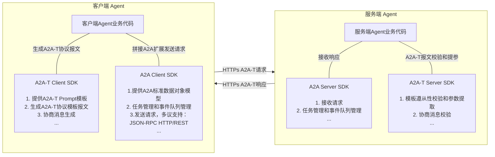
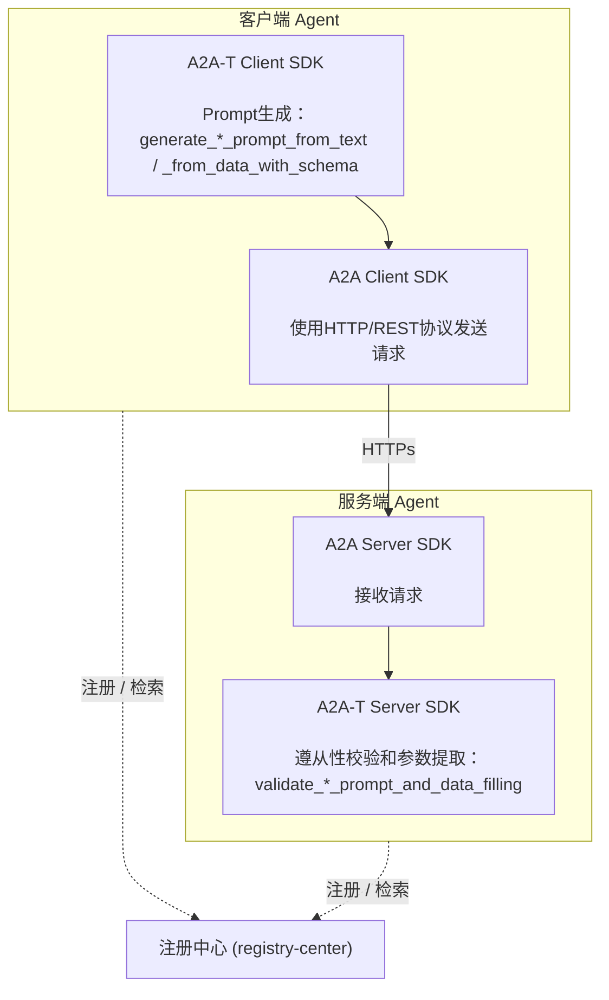
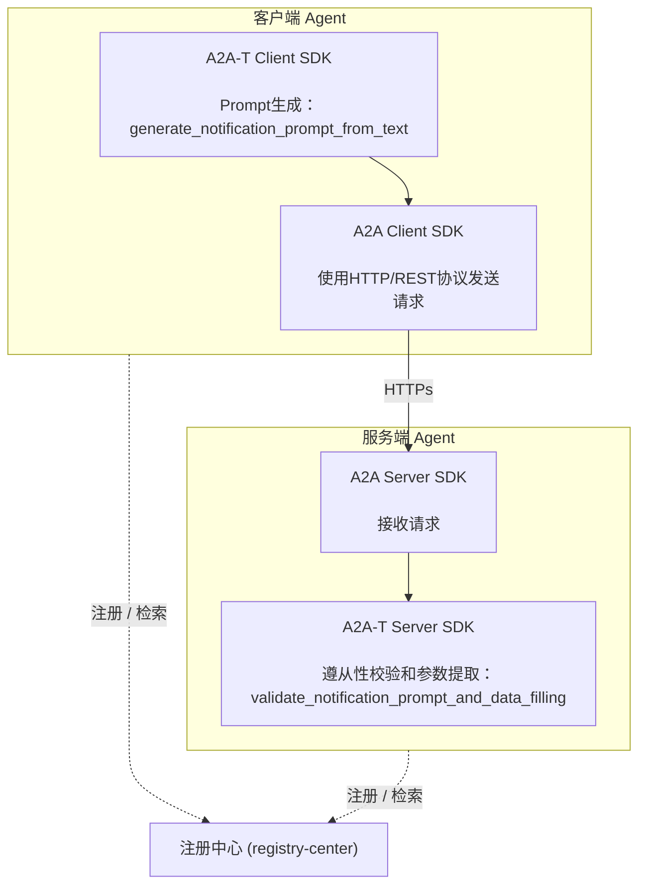
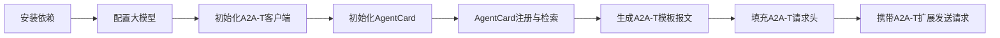
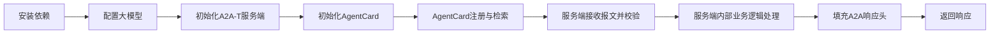

# 1 a2a-t-sdk-python 开发指南

> SDK 版本：1.1.0 —— 本版本对应 Java a2a-t-sdk 1.1.0 能力面。

| 分类     | 说明                                                         |
| -------- | ------------------------------------------------------------ |
| 目标读者 | 基于A2A-T SDK进行多智能体协议交互的开发者、集成部署人员、项目对接运维人员 |
| 文档目的 | 本文档详细介绍A2A-T SDK的架构、完整API面、资源访问层、错误模型、开发工作流与测试基建，帮助开发者快速、规范地完成SDK接入、功能开发和扩展。 |
| 阅读前提 | 了解A2A多智能体协议的数据模型定义和使用，了解AgentCard模型定义和使用，了解注册中心相关功能 |

## 1.1 特性介绍

### 1.1.1 A2A-T能力介绍
A2A-T（Agent-to-Agent Telecom）是基于A2A协议推出的电信领域多智能体互联协议，专为电信领域复杂协同场景设计。

业界通用智能体互联协议主要关注智能体互联和交互框架，对业务场景和具体交互内容关注不足，导致任务完成的成功率不高。电信领域的业务场景复杂、要求高，运维智能体互联和协同需要有专门的协议进行支撑。A2A-T方案基于A2A协议，重点针对电信领域业务流相关的信息模型、任务协商、协作安全等增强能力进行应用扩展。

a2a-t-sdk-python是面向电信智能体协作场景的 Python SDK，用于在 A2A-T 交互中生成、校验和协商任务提示词。SDK 适合客户端 Agent、服务端 Agent 以及上层编排系统集成使用。

主要能力包括：

- **任务提示词生成**：客户端从自然语言（场景识别）或文本/结构化输入（显式指定模板）生成符合 A2A-T 格式的协议报文。
- **服务端提示词校验与参数填充**：服务端校验客户端下发的 A2A-T 协议报文是否匹配场景、模板和槽位约束，并按调用方提供的 schema 提取参数。
- **协商内容 API**：Negotiation-T 扩展上的 12 个方法 —— 8 个消息生成方法（`generate_{propose,accept,reject,abort}_prompt_from_{data,text}`）与 4 个消息校验方法（`validate_{propose,accept,reject,abort}_prompt_and_data_filling`）。
- **提示词资源管理**：内置场景、槽位、模板、词表和系统提示词资源，双语（zh-CN / en-US）成对提供，业务内容支持本地文件覆盖。
- **LLM 适配**：通过 OpenAI-compatible 调用链接入外部大模型，对可重试失败码提供有界重试。
- **结构化双语错误模型**：封闭的 42 个机器可读错误码目录（含事实参数）与双语消息模板。

### 1.1.2 A2A-T SDK与A2A SDK的关系

A2A-T协议是基于A2A协议的扩展，针对协议扩展的内容提供了A2A-T SDK，支撑快速构建满用于电信领域复杂协同场景的智能体。A2A-T SDK独立于A2A SDK，通过同时集成A2A-T SDK与A2A SDK可以构建支持A2A-T协议的agent，支持电信领域多agent之间的确定性、高可靠、高效及安全协同。



### 1.1.3 A2A-T SDK的典型交互场景

一个典型的多智能体协作交互场景至少涉及三个组件：客户端 Agent、服务端 Agent 与注册中心。



当首个提示词携带的任务信息不完整时，双方切换到协商流程：服务端生成 Negotiation-T propose 消息询问缺失信息，客户端校验该消息、补齐所请求的参数后，以 Task-T 提示词加 Negotiation-T accept 消息应答。完整闭环见 `a2a-t-sample/negotiation/` 离线样例（见 1.6.6）。

## 1.2 约束与限制

1. Python 版本要求为 3.12+。
2. 完整的多智能体协议交互开发需要同时引入`a2a-sdk`，要求版本为 1.1.0+。
3. SDK 无状态：协商会话状态随每条消息的 A2A-T metadata（`negotiationContext`）往返，不保存在 SDK 内部。
4. 旧的状态机协商 demo（`start_negotiation` / `receive_negotiation` / `continue_negotiation` 及 `negotiation/{types,store,runtime,handling}` 包）自 1.1.0 起废弃（调用时发出 `DeprecationWarning`），将在下一版本删除。
5. A2A-T SDK 不提供 Agent HTTP 服务框架、注册中心客户端、鉴权和密钥管理能力，需由业务系统集成。

## 1.3 环境准备

### 1.3.1 环境要求

| 项目       | 要求                                              |
| ---------- | ------------------------------------------------- |
| Python SDK | Python 3.12+                                      |
| 依赖管理   | 推荐使用 `uv`                                     |
| LLM        | 需要可访问的 OpenAI 兼容服务及 API Key（离线测试与样例不需要） |
| 操作系统   | Linux、Windows、macOS 均可用于开发和联调           |

### 1.3.2 搭建环境

以Windows11 64位 amd64 开发环境为例

**安装Python 3.12**

1. 官网下载链接：https://www.python.org/ftp/python/3.12.10/python-3.12.10-amd64.exe

2. 以管理员身份执行`python-3.12.10-amd64.exe`

3. **务必勾选**：Add Python 3.12 to PATH

4. 安装完成，打开终端输入校验命令：

   ```shell
   python --version
   # 预期输出：Python 3.12.10
   ```

**安装uv**

1. 安装完Python之后，使用pip安装uv，在终端中输入：`python -m pip install uv`

2. 安装完成，输入校验命令：

   ```shell
   uv --version
   # 预期输出：uv 0.12.1 (329541a50 2026-07-31 x86_64-pc-windows-msvc)
   ```

3. 安装项目依赖并运行测试：

   ```shell
   cd {项目路径}/a2a-t-sdk-python
   uv sync --dev
   uv run pytest -q
   ```

## 1.4 架构总览

### 1.4.1 包结构

SDK 为单包结构（`src/a2a_t/`），运行时依赖刻意收敛在 `jsonschema`、`python-dotenv`、`openai` 三件。

| 包 | 职责 |
| --- | --- |
| `a2a_t.core` | 横切基座：模板寻址（`template_uri`、`standard_templates`、`path_segments`、`prompt_resource_key`）、生成消息的 metadata 模型（`metadata`）、共享内容校验管线（`validation_pipeline`）、错误模型（`core/errors`：`catalog`、`messages`、`exceptions`、`input_limit`） |
| `a2a_t.common.prompt_resources` | 唯一资源访问层（见 1.7）：`resource_access` 路由、`packaged_access`（importlib.resources）、`local_file_access`（冻结快照）、`template_source`、`json_source`、`vocabulary`，以及模板目录与查询服务（`catalog`） |
| `a2a_t.common.prompt_runtime` | prompt 管线共享的运行时组件 |
| `a2a_t.prompt` | prompt 管线：`analysis`（场景识别、槽位抽取）、`task_rendering`（`sectioned_renderer` 两个显式渲染策略、`task_prompt_renderer`）、`validation` |
| `a2a_t.negotiation.content` | 协商消息的类型化内容模型：冻结数据类（`models`）、枚举（`enums`）、词表键契约（`vocabulary`）、共享的确认请求校验（`confirm_request`） |
| `a2a_t.negotiation.generation` | 协商生成管线：`content_service`（12 方法的 `NegotiationContentService`）、`orchestrator`、`generators`（函数式生成器 + 分派注册表）、`content_extractor`（LLM 抽取腿）、`message_builder`、`json_schema_builder` |
| `a2a_t.negotiation.validation` | 协商校验管线：`compliance_checker`（确定性规则门）、`semantic_validator`（LLM 语义门）、`param_extractor`（委托 core `ValidationPipeline`） |
| `a2a_t.negotiation.resources` | `NegotiationReference` 领域类型（协商类型的模板寻址）；不含任何 IO —— 资源加载一律经公共层 |
| `a2a_t.client` | `A2ATClient` 门面及其 prompt 生成 / 协商 orchestrator |
| `a2a_t.server` | `A2ATServer` 门面及其 prompt 合规 / 协商 orchestrator |
| `a2a_t.config` | 基于 `.env` 的配置：`source`（显式路径 dotenv）、`models`（`A2ATConfig`、`PromptRuntimeConfig`、`LlmRuntimeConfig`） |
| `a2a_t.llm` | LLM 适配：`LLMClient` 协议、带提供方注册的工厂、OpenAI 兼容提供方与配置加载 |
| `a2a_t.prompt_resources` | 打包资源数据树：`templates/`、`slots/`、`scenarios/`、`negotiation-vocabulary/`、`prompts/`、`errors/` |

旧 demo 包 `a2a_t.negotiation.{types,store,runtime,handling,rendering,common}` 已废弃（见 1.2），新代码不得使用。

### 1.4.2 设计不变量

三条不变量贯穿整个 SDK，并由测试钉死：

1. **唯一资源访问层**。prompt 管线与协商管线一律通过 `a2a_t.common.prompt_resources.resource_access` 读取资源；任何其他模块不得自行拼装资源路径或持有资源缓存。
2. **唯一错误码目录**。每个业务失败都携带封闭 `ErrorCatalog` 中的码；LLM 步骤返回的目录外错误码一律映射到各域的 `*.rule_violation` 兜底码，绝不透出原始文本。
3. **SDK 无状态**。协商会话状态保存在消息 metadata（`negotiationContext`）中，两个门面都无需服务端存储即可服务任意数量的会话。

## 1.5 API面总览

### 1.5.1 A2ATClient

| 方法 | 说明 |
| --- | --- |
| `generate_task_prompt(user_input)` | 场景识别入口；返回 `PromptGenerationResult`（结果轨） |
| `generate_{task,auth,notification}_prompt_from_text(text, template_uri)` | 显式寻址模板，从自然语言生成提示词；一次 LLM 槽位抽取后确定性渲染；返回 `MetadataContent` |
| `generate_{task,auth,notification}_prompt_from_data_with_schema(data, schema, template_uri)` | 同上，但输入为结构化数据加字段说明 schema；返回 `MetadataContent` |
| `generate_negotiation_{propose,accept,reject,abort}_prompt_from_data(data, template_uri)` | 从类型化内容确定性生成协商消息（零 LLM 调用）；返回 `MetadataContent` |
| `generate_negotiation_{propose,accept,reject,abort}_prompt_from_text(text, context, template_uri)` | 从自由文本生成协商消息；一次可重试 LLM 内容抽取；返回 `MetadataContent` |
| `validate_{propose,accept,reject,abort}_prompt_and_data_filling(prompt, context, schema, template_uri)` | 校验协商消息并提取参数；返回 `FilledParamData` |
| `get_prompts()` / `get_prompt(template_uri)` | 与扩展无关的模板查询；URI 良构时永不抛异常 |
| `start_negotiation` / `receive_negotiation` / `continue_negotiation` | 已废弃的旧状态机 demo；发出 `DeprecationWarning` |

### 1.5.2 A2ATServer

服务端门面暴露相同的十二个协商方法与相同的模板查询，另有其专属校验面：

| 方法 | 说明 |
| --- | --- |
| `check_task_prompt(*, processed_prompt_text)` | 对 processed task prompt 做场景/模板/槽位合规校验；返回 `PromptComplianceResult`（结果轨） |
| `validate_{task,notification,auth}_prompt_and_data_filling(prompt, schema, template_uri)` | 按寻址扩展与调用方提供的参数 JSON schema 校验提示词并提取参数；返回 `FilledParamData` |
| `generate_negotiation_*` / `validate_{propose,accept,reject,abort}_prompt_and_data_filling` / `get_prompts` / `get_prompt` | 与客户端面完全一致（两个门面共享同一个 `NegotiationContentService` 与 `TemplateQueryService`） |
| `start_negotiation` / `receive_negotiation` / `continue_negotiation` | 已废弃的旧状态机 demo |

### 1.5.3 共享数据类型

- `MetadataContent`（`a2a_t.core.metadata`）—— 生成成功结果：`template_uri`、`prompt_text`、`extension_uri` 与可选的 `negotiation_context`；`build_metadata_content()` 产出可直接使用的 A2A-T metadata 映射（扩展 URI → 提示词文本，另带 `templateUri`，协商消息再加 `negotiationContext`）。
- `NegotiationContext` / `NegotiationPerformative`（`a2a_t.core.metadata`）—— 会话上下文（`id` UUID、`round`、`max_rounds`、`performative`）；不可变，`next_round()` / `with_performative()` 派生新实例。
- `FilledParamData`（`a2a_t.core.validation_pipeline`）—— 参数提取结果：`data` 把参数名映射到提取值。
- `PromptGenerationResult` / `PromptGenerationFailure` 与 `PromptComplianceResult` / `PromptComplianceFailure` —— 结果轨数据类，携带 `success` 与结构化 `failure`（`code` / `message` / `stage`）。
- `PromptTemplate`（`a2a_t.common.prompt_resources`）—— 一个可加载模板：`template_uri`、`description`、`content` 与 `source`（`packaged` 或 `local`）。

两个门面都在边界上对 `template_uri` 快速失败解析：`None` 抛 `TypeError`，空白或畸形 URI（少于三段，或存在非简单路径段）抛出消息为 `Unparseable template URI: <input>` 的 `ValueError`。

## 1.6 基础开发样例

### 1.6.1 系统架构

一个基础多智能体协作交互流程涉及到至少三个组件：客户端Agent、服务端Agent、注册中心

基础架构如下：



### 1.6.2 样例接口说明

本基础开发样例主要使用到A2A-T SDK如下两个API，实际开发过程中需按业务实际诉求选择不同API使用：

**1、A2A-T Client SDK**

接口定义及功能描述：根据自然语言文本与指定 Notification-T 模板生成通知订阅提示词报文（跳过场景识别）。执行一次 LLM 槽位抽取后确定性渲染模板；生成阶段做内置槽位 schema 校验。

```python
def generate_notification_prompt_from_text(self, text: str, template_uri: str | TemplateUri) -> MetadataContent
```

接口调用样例：

```python
from pathlib import Path

from a2a_t.client.a2at_client import A2ATClient

client = A2ATClient(env_path=Path("package_data/.env"))

metadata = client.generate_notification_prompt_from_text(
    "请生成一个Incident事件订阅任务：通知主题为Incident，订阅级别为critical、medium、high、low，"
    "上报通知数据格式为DataPart",
    "Notification-T/network-layer/subscribe-incident/v1",
)

print(metadata.prompt_text)              # 渲染出的提示词报文
print(metadata.build_metadata_content()) # 可直接发送的 A2A-T metadata 映射

"""输出生成的通知订阅提示词报文（metadata.prompt_text；实际文本随 LLM 槽位抽取结果变化）：
## 订阅描述
请根据以下 <通知主题>、<订阅条件>、<上报通知数据格式>及<预期输出> 信息，完成网络侧智能故障Incident订阅与上报任务。

## 通知主题
该主题的名称是"incident"

## 订阅条件
故障级别为"critical"、"medium"、"high"、"low"

## 上报通知数据格式
通过DataPart上报Incident数据

## 预期输出
1、订阅结果，成功或失败
2、订阅失败原因（可选）
"""
```

**2、A2A-T Server SDK**

接口定义及功能描述：校验 Notification-T 通知订阅提示词报文是否匹配模板与槽位约束，并按调用方 schema 提取参数（订阅主题、订阅条件、上报通知数据格式等）。

```python
def validate_notification_prompt_and_data_filling(
    self,
    prompt: str,
    schema: Mapping[str, object],
    template_uri: str | TemplateUri,
) -> FilledParamData
```

接口调用样例：校验客户端下发的通知订阅报文并提取订阅参数

```python
from pathlib import Path

from a2a_t.server.a2at_server import A2ATServer

server = A2ATServer(env_path=Path("package_data/.env"))

validation_schema = {
    "type": "object",
    "properties": {
        "topic": {
            "type": "string",
            "description": "订阅主题（必填）。要订阅的事件主题名称。",
        },
        "subscriptionCondition": {
            "type": "string",
            "description": "订阅条件（可选）。要订阅的条件的描述。",
        },
        "notificationDataFormat": {
            "type": "string",
            "description": "上报通知数据格式（必填）。要上报的通知数据格式的描述。",
        },
    },
    "required": ["topic", "notificationDataFormat"],
}

# prompt_text 为客户端生成的通知订阅提示词报文文本
filled = server.validate_notification_prompt_and_data_filling(
    metadata.prompt_text, validation_schema, "Notification-T/network-layer/subscribe-incident/v1"
)

print(filled.data)
# 按 schema 提取出的订阅参数，例如
# {'topic': 'Incident', 'subscriptionCondition': '', 'notificationDataFormat': 'DataPart'}
```

对应的纯合规校验 API `check_task_prompt(processed_prompt_text=...)` 返回 `PromptComplianceResult`，其 `failure` 在驳回时携带 `code` / `message` / `stage`；两者可以组合使用 —— 先做合规校验，合规通过后再做参数填充。

### 1.6.3 开发流程

- 客户端开发流程



- 服务端开发流程：



### 1.6.4 样例客户端开发步骤

#### 1.6.4.1 安装依赖

```bash
# A2A-T SDK
pip install a2a-t-sdk

# A2A 官方 Python SDK
pip install a2a-sdk
```

> A2A 请求的发送、响应的接收和服务端路由组装使用官方 `a2a-sdk`（其传输层依赖 `httpx`）；注册中心不属于官方 SDK 能力范围，本指南使用 `httpx` 直接与其交互，业务系统可替换为 `requests` 等任意 HTTP 客户端。服务端启动 HTTP 服务还需安装 `uvicorn`：
>
> ```bash
> pip install uvicorn
> ```

#### 1.6.4.2 配置大模型

将仓库根目录 `env.example` 的内容复制到 `package_data/.env`（门面的默认读取位置），配置如下内容：

```properties
A2AT_LANGUAGE=zh-CN
A2AT_PROMPT_SOURCE_TYPE=packaged
A2AT_PROMPT_COMPLIANCE_ENABLED=true
A2AT_INPUT_TEXT_MAX_CHARS=16384
A2AT_LLM_PROVIDER=openai
A2AT_LLM_MODEL=deepseek-chat
A2AT_LLM_API_KEY={your_llm_api_key}
A2AT_LLM_BASE_URL=https://api.deepseek.com
A2AT_LLM_MAX_ATTEMPTS=3
```

> `A2AT_LLM_API_KEY` 是**调用外部大模型**使用的密钥，请妥善保存
>
> SDK 通过 OpenAI-compatible 接入外部大模型，`A2AT_LLM_PROVIDER` 当前仅支持 `openai`；接入 DeepSeek 等 OpenAI 兼容服务时，通过 `A2AT_LLM_BASE_URL` 指定服务地址、`A2AT_LLM_MODEL` 指定模型名。
>
> 自 1.1.0 起 `A2AT_PROMPT_SOURCE_TYPE` 默认值为 `packaged`（1.1.0 之前为 `local_file`）；资源来源语义与迁移路径见 1.7 与 1.12。

#### 1.6.4.3 初始化A2A-T客户端

```python
from pathlib import Path
from a2a_t.client.a2at_client import A2ATClient

client = A2ATClient(env_path=Path("package_data/.env"))
```

`A2ATClient` 与 `A2ATServer` 均可传入 `env_path`；不传时默认读取 `package_data/.env`。

#### 1.6.4.4 初始化AgentCard

客户端样例AgentCard定义参考：

> 可在`extensions`中声明支持的A2A-T模板

```json
{
  "agentCards": [
    {
      "name": "Transmission workbench agent",
      "description": "传输网络运维管理智能体，提供电路恢复验证、基站退服根因分析、网元隐患排查等运维能力",
      "supportedInterfaces": [
        {
          "url": "http://10.xx.xx.xx:26335/a2a/v1",
          "protocolBinding": "HTTP+JSON",
          "protocolVersion": "1.0"
        }
      ],
      "provider": {
        "organization": "ZzNode"
      },
      "version": "1.0.0",
      "capabilities": {
        "streaming": true,
        "pushNotifications": false,
        "extensions": [
          {
            "uri": "https://projects.tmforum.org/a2aproject/telecommunication/extensions/Task-T/v1",
            "description": "Extension of structured prompt Task-T requests."
          },
          {
            "uri": "https://projects.tmforum.org/a2aproject/telecommunication/extensions/Notification-T/v1",
            "description": "Extension of structured prompt Notification-T requests."
          }
        ],
        "extendedAgentCard": false
      },
      "securitySchemes": {
        "bearerAuth": {
          "httpAuthSecurityScheme": {
            "description": "使用用户名和密码通过登录接口查询accessSession后，使用该accessSession进行bearer认证。",
            "scheme": "Bearer"
          }
        }
      },
      "defaultInputModes": [
        "application/json",
        "text/plain"
      ],
      "defaultOutputModes": [
        "application/json",
        "text/plain"
      ],
      "skills": [
        {
          "id": "ne-hidden-danger",
          "name": "网元隐患排查智能体",
          "description": "网元隐患排查技能。根据输入的网元名称，排查该网元是否还存在新的隐患。",
          "tags": [
            "网元排查",
            "隐患排查",
            "NE-inspection"
          ],
          "examples": [
            "请排查QZHA-HAZBYSDGG-HRHH网元是否还产生新隐患"
          ],
          "inputModes": [
            "application/json",
            "text/plain"
          ],
          "outputModes": [
            "application/json",
            "text/plain"
          ]
        }
      ]
    }
  ]
}
```

注册中心中的 AgentCard 以 JSON 形式存储。构造官方 A2A 客户端或组装服务端路由时，需将其转换为官方 SDK 的 `a2a.types.AgentCard` 对象：

```python
from a2a.types import AgentCard
from google.protobuf.json_format import ParseDict

agent_card = ParseDict(agent_card_dict, AgentCard())
```

#### 1.6.4.5 AgentCard注册与检索

- **AgentCard注册**：将客户端AgentCard发布到注册中心，注册中心的地址和URI以实际部署情况为准

```python
import httpx

AGENT_CARD = {...}  # 1.6.4.4 定义的 AgentCard JSON

def register_agent_card(registry_url: str, agent_card: dict) -> None:
    resp = httpx.post(
        registry_url,
        json=agent_card,
        timeout=10,
    )
    resp.raise_for_status()
```

- **AgentCard检索**：根据目标Agent名称或技能，从注册中心查询并获取其 AgentCard，从而得到 `url` 和支持的技能

```python
import httpx

def discover_agent(discover_url: str, task: str) -> dict:
    resp = httpx.post(
        discover_url,
        params={"task": task},
        timeout=10,
    )
    resp.raise_for_status()
    return resp.json()["agentCards"][0]
```

#### 1.6.4.6 生成A2A-T模板报文

客户端使用 A2A-T Client SDK API 生成 `MetadataContent`，再将其提示词文本与模板 URI 作为 A2A 消息 metadata 的一部分发送给目标 agent：

```python
from pathlib import Path
from a2a_t.client.a2at_client import A2ATClient
from a2a_t.core.standard_templates import SUBSCRIBE_INCIDENT_URI

client = A2ATClient(env_path=Path("package_data/.env"))

metadata = client.generate_notification_prompt_from_text(
    "请生成一个Incident事件订阅任务：通知主题为Incident，订阅级别为critical、medium、high、low，"
    "上报通知数据格式为DataPart",
    SUBSCRIBE_INCIDENT_URI,
)

processed_prompt = metadata.prompt_text
a2at_metadata = metadata.build_metadata_content()
```

#### 1.6.4.7 填充A2A-T 请求头

A2A 协议通过 HTTP Header 传递协议版本与扩展声明，需使用如下Header

| Header           | 方向   | 必填                 | 取值                                              |
| ---------------- | ------ | -------------------- | ------------------------------------------------- |
| `A2A-Version`    | 请求头 | 是                   | 协议版本，如 `1.0`（客户端必须随每个请求携带）    |
| `A2A-Extensions` | 请求头 | 否（使用扩展时建议） | 逗号分隔的扩展 URI 列表，声明本次请求要使用的扩展 |

使用官方 A2A Client 时，请求头通过 `ClientCallContext.service_parameters` 传入（键值对将作为 HTTP 请求头随请求发送），`A2A-Version` 等协议头由官方客户端自动携带：

```python
from a2a.client.client import ClientCallContext

NOTIFICATION_PROMPT_EXT = "https://projects.tmforum.org/a2aproject/telecommunication/extensions/Notification-T/v1"

ACCESS_TOKEN = "{your_access_token}"

context = ClientCallContext(
    service_parameters={
        "A2A-Extensions": NOTIFICATION_PROMPT_EXT,
        "Authorization": f"Bearer {ACCESS_TOKEN}",
    },
)
```

#### 1.6.4.8 携带A2A-T扩展发送请求

使用官方 `ClientFactory` 创建 A2A 客户端，通过 `SendMessageRequest` 构造请求（A2A-T 提示词放在 `message.metadata` 中，以扩展 URI 为 key），并通过 `ClientCallContext` 声明扩展请求头：

```python
import uuid

from a2a.client.client import ClientCallContext, ClientConfig
from a2a.client.client_factory import ClientFactory
from a2a.types import AgentCard, Role, SendMessageRequest
from a2a.utils.constants import TransportProtocol

from pathlib import Path
from a2a_t.client.a2at_client import A2ATClient
from google.protobuf.json_format import ParseDict

NOTIFICATION_PROMPT_EXT = "https://projects.tmforum.org/a2aproject/telecommunication/extensions/Notification-T/v1"

ACCESS_TOKEN = "{your_access_token}"

# 1) 生成 A2A-T 提示词（见 1.6.4.6）
client = A2ATClient(env_path=Path("package_data/.env"))
metadata = client.generate_notification_prompt_from_text(
    "请生成一个Incident事件订阅任务：通知主题为Incident，订阅级别为critical、medium、high、low，"
    "上报通知数据格式为DataPart",
    "Notification-T/network-layer/subscribe-incident/v1",
)

# 2) 构造官方 A2A 客户端（AgentCard 来自注册中心，见 1.6.4.5）
agent_card = ParseDict(agent_card_dict, AgentCard())
a2a_client = ClientFactory(
    ClientConfig(
        supported_protocol_bindings=[TransportProtocol.HTTP_JSON],
        use_client_preference=True,
    )
).create(agent_card)

# 3) 构造请求（请求头声明扩展，消息体携带 A2A-T metadata）
request = SendMessageRequest()
request.message.message_id = str(uuid.uuid4())
request.message.role = Role.ROLE_USER
request.message.parts.add().text = "创建智能故障incident上报任务"
for key, value in metadata.build_metadata_content().items():
    request.message.metadata[key] = str(value)

context = ClientCallContext(
    service_parameters={
        "A2A-Extensions": NOTIFICATION_PROMPT_EXT,
        "Authorization": f"Bearer {ACCESS_TOKEN}",
    },
)

# 4) 发送请求并消费响应流（StreamResponse：status_update / artifact_update / message）
async for stream_response in a2a_client.send_message(request, context=context):
    if stream_response.HasField("status_update"):
        print("status:", stream_response.status_update.status.state)
    elif stream_response.HasField("artifact_update"):
        print("artifact:", stream_response.artifact_update.artifact.name)
    elif stream_response.HasField("message"):
        print("message:", stream_response.message.parts[0].text)

await a2a_client.close()
```

#### 1.6.4.9 样例客户端完整代码

```python
import asyncio
import uuid
from pathlib import Path

import httpx
from a2a.client.client import ClientCallContext, ClientConfig
from a2a.client.client_factory import ClientFactory
from a2a.types import AgentCard, Role, SendMessageRequest
from a2a.utils.constants import TransportProtocol
from a2a_t.client.a2at_client import A2ATClient
from google.protobuf.json_format import ParseDict

NOTIFICATION_PROMPT_EXT = "https://projects.tmforum.org/a2aproject/telecommunication/extensions/Notification-T/v1"

ACCESS_TOKEN = "{your_access_token}"

AGENT_CARD = {...}  # 1.6.4.4 定义的 AgentCard JSON

def register_agent_card(registry_url: str, agent_card: dict) -> None:
    resp = httpx.post(
        registry_url,
        json=agent_card,
        timeout=10,
    )
    resp.raise_for_status()

def discover_agent(discover_url: str, task: str) -> dict:
    resp = httpx.post(
        discover_url,
        params={"task": task},
        timeout=10,
    )
    resp.raise_for_status()
    return resp.json()["agentCards"][0]

async def main() -> None:
    # 1) 注册客户端AgentCard，检索服务端AgentCard（注册中心为业务系统侧组件）
    register_agent_card("{ip:port}/rest/v1/registry-center/agent-cards", AGENT_CARD)
    agent_card_dict = discover_agent("{ip:port}/rest/v1/registry-center/agent-cards/semantic-query", task="需要订阅故障")

    # 2) 使用SDK能力生成 A2A-T 提示词
    client = A2ATClient(env_path=Path("package_data/.env"))
    metadata = client.generate_notification_prompt_from_text(
        "请生成一个Incident事件订阅任务：通知主题为Incident，订阅级别为critical、medium、high、low，"
        "上报通知数据格式为DataPart",
        "Notification-T/network-layer/subscribe-incident/v1",
    )

    # 3) 构造官方 A2A 客户端
    agent_card = ParseDict(agent_card_dict, AgentCard())
    a2a_client = ClientFactory(
        ClientConfig(
            supported_protocol_bindings=[TransportProtocol.HTTP_JSON],
            use_client_preference=True,
        )
    ).create(agent_card)

    # 4) 构造请求（请求头声明扩展，消息体携带 A2A-T metadata）
    request = SendMessageRequest()
    request.message.message_id = str(uuid.uuid4())
    request.message.role = Role.ROLE_USER
    request.message.parts.add().text = "创建智能故障incident上报任务"
    for key, value in metadata.build_metadata_content().items():
        request.message.metadata[key] = str(value)

    context = ClientCallContext(
        service_parameters={
            "A2A-Extensions": NOTIFICATION_PROMPT_EXT,
            "Authorization": f"Bearer {ACCESS_TOKEN}",
        },
    )

    # 5) 发送请求并消费响应流
    async for stream_response in a2a_client.send_message(request, context=context):
        if stream_response.HasField("status_update"):
            print("status:", stream_response.status_update.status.state)
        elif stream_response.HasField("artifact_update"):
            print("artifact:", stream_response.artifact_update.artifact.name)
        elif stream_response.HasField("message"):
            print("message:", stream_response.message.parts[0].text)

    await a2a_client.close()

asyncio.run(main())
```

### 1.6.5 样例服务端开发步骤

#### 1.6.5.1 前置步骤

安装依赖、配置大模型、初始化AgentCard、AgentCard注册与检索等步骤均可以参考[客户端实现](#1641)，差异化的内容如下：

- 初始化A2A-T服务端

```python
from pathlib import Path
from a2a_t.server.a2at_server import A2ATServer

server = A2ATServer(env_path=Path("package_data/.env"))
```

- 初始化AgentCard，服务端样例AgentCard定义参考：

```json
{
  "agentCards": [
    {
      "name": "RAN Domain Agent",
      "description": "RAN Domain Agent",
      "provider": {
        "organization": "Huawei",
        "url": "https://www.huawei.com"
      },
      "version": "1.0.0",
      "capabilities": {
        "streaming": true,
        "pushNotifications": false,
        "extendedAgentCard": false,
        "extensions": [
          {
            "description": "Extension of structured prompt TASK-T requests.",
            "required": false,
            "uri": "https://projects.tmforum.org/a2aproject/telecommunication/extensions/Task-T/v1"
          },
          {
            "description": "Extension of structured prompt Notification-T requests.",
            "required": false,
            "uri": "https://projects.tmforum.org/a2aproject/telecommunication/extensions/Notification-T/v1"
          }
        ]
      },
      "defaultInputModes": [
        "application/json",
        "text/plain"
      ],
      "defaultOutputModes": [
        "application/json",
        "text/plain"
      ],
      "skills": [
        {
          "id": "ran-incident-subscription",
          "name": "Incident上报",
          "description": "支持上报Incident，提供故障智能识别与诊断能力",
          "tags": [
            "Incident上报"
          ],
          "examples": [
            "## 订阅描述\n请根据以下 <通知主题>、<订阅条件>、<上报通知数据格式> 及 <预期输出> 信息，完成网络侧智能故障Incident的订阅与上报任务。\n## 通知主题\n该主题的名称是\"incident\"\n## 订阅条件\n故障级别为\"高\"\n## 上报通知数据格式\n通过DataPart上报Incident数据\n## 预期输出\n1、订阅结果，成功或失败\n2、订阅失败原因（可选）"
          ],
          "inputModes": [
            "application/json",
            "text/plain"
          ],
          "outputModes": [
            "application/json",
            "text/plain"
          ]
        }
      ],
      "securitySchemes": {
        "bearerAuth": {
          "httpAuthSecurityScheme": {
            "scheme": "Bearer",
            "description": "使用用户名和密码通过登录接口查询accessSession后，使用该accessSession进行bearer认证。"
          }
        }
      },
      "securityRequirements": [],
      "supportedInterfaces": [
        {
          "protocolBinding": "JSONRPC",
          "url": "https://10.xx.xx.xx:27417/a2a/v1",
          "tenant": "",
          "protocolVersion": "1.0"
        },
        {
          "protocolBinding": "HTTP+JSON",
          "url": "https://10.xx.xx.xx:27417/a2a/json",
          "tenant": "",
          "protocolVersion": "1.0"
        }
      ]
    }
  ]
}
```

#### 1.6.5.2 服务端接收报文并校验

官方 A2A Server 通过 `AgentExecutor` 回调业务逻辑。在 `execute` 回调中：先从 `RequestContext` 校验客户端声明的扩展请求头，再从 `message.metadata`（以扩展 URI 为 key）取出 processed task prompt，交给 `A2ATServer.check_task_prompt` 做合规校验、交给 `validate_notification_prompt_and_data_filling` 提取参数，最后按校验结果向 `EventQueue` 推送任务状态：

```python
import uuid

from a2a.server.agent_execution.agent_executor import AgentExecutor
from a2a.server.agent_execution.context import RequestContext
from a2a.server.events.event_queue import EventQueue
from a2a.types import Artifact, Message, Role, Task, TaskState, TaskStatus, TaskStatusUpdateEvent
from google.protobuf.json_format import MessageToDict, ParseDict
from google.protobuf.struct_pb2 import Value

from pathlib import Path
from a2a_t.core.errors.exceptions import ContentValidationError
from a2a_t.server.a2at_server import A2ATServer

NOTIFICATION_PROMPT_EXT = "https://projects.tmforum.org/a2aproject/telecommunication/extensions/Notification-T/v1"
NOTIFICATION_TEMPLATE_URI = "Notification-T/network-layer/subscribe-incident/v1"

PARAM_SCHEMA = {
    "type": "object",
    "properties": {
        "topic": {"type": "string", "description": "订阅主题（必填）"},
        "notificationDataFormat": {"type": "string", "description": "上报通知数据格式（必填）"},
    },
    "required": ["topic", "notificationDataFormat"],
}

class NotificationAgentExecutor(AgentExecutor):
    """处理 Notification-T 扩展请求的服务端执行器"""

    def __init__(self, prompt_server: A2ATServer) -> None:
        self._prompt_server = prompt_server

    async def execute(self, context: RequestContext, event_queue: EventQueue) -> None:
        task_id = context.task_id or ""
        context_id = context.context_id or ""

        # 1) 校验客户端声明的 A2A-T 扩展（对应请求头 A2A-Extensions）
        if NOTIFICATION_PROMPT_EXT not in context.requested_extensions:
            raise ValueError("missing Notification-T extension")

        # 2) 从 message.metadata 提取 processed task prompt
        if context.message is None or context.message.metadata is None:
            raise ValueError("missing A2A-T task prompt")
        processed_prompt = str(MessageToDict(context.message.metadata).get(NOTIFICATION_PROMPT_EXT, ""))

        # 3) 推送 SUBMITTED 状态
        task = Task(
            id=task_id,
            context_id=context_id,
            status=TaskStatus(
                state=TaskState.TASK_STATE_SUBMITTED,
                message=self._build_message(task_id, context_id, "subscription accepted"),
            ),
        )
        context.current_task = Task()
        context.current_task.CopyFrom(task)
        await event_queue.enqueue_event(task)

        # 4) 使用 A2A-T SDK 做完备性校验（合规校验，结果轨）
        check_result = self._prompt_server.check_task_prompt(processed_prompt_text=processed_prompt)
        if not check_result.success:
            # 校验失败：推送 REJECTED（failure 携带 code、message、stage）
            await self._emit_status(event_queue, task_id, context_id, TaskState.TASK_STATE_REJECTED, f"prompt validation failed: {check_result.failure}")
            return

        # 5) 校验通过：提取订阅参数（异常轨）
        try:
            filled = self._prompt_server.validate_notification_prompt_and_data_filling(
                processed_prompt, PARAM_SCHEMA, NOTIFICATION_TEMPLATE_URI
            )
        except ContentValidationError as exc:
            await self._emit_status(event_queue, task_id, context_id, TaskState.TASK_STATE_REJECTED, f"parameter extraction failed: {exc.code_str}")
            return

        # 6) 执行业务并推送 artifact，随后 COMPLETED
        await self._emit_status(event_queue, task_id, context_id, TaskState.TASK_STATE_WORKING, "incident reporting in progress")

        artifact = Artifact(artifact_id=str(uuid.uuid4()), name="faultManagement.Incident")
        artifact.parts.add(data=ParseDict(execute_business(filled.data), Value()))
        await event_queue.enqueue_event(
            TaskArtifactUpdateEvent(task_id=task_id, context_id=context_id, artifact=artifact, last_chunk=True)
        )

        await self._emit_status(event_queue, task_id, context_id, TaskState.TASK_STATE_COMPLETED, "task completed")

    async def cancel(self, context: RequestContext, event_queue: EventQueue) -> None:
        return None

    @staticmethod
    def _build_message(task_id: str, context_id: str, text: str) -> Message:
        message = Message(task_id=task_id, context_id=context_id, role=Role.ROLE_AGENT)
        message.parts.add(text=text)
        return message

    async def _emit_status(
        self,
        event_queue: EventQueue,
        task_id: str,
        context_id: str,
        state: TaskState,
        text: str,
    ) -> None:
        await event_queue.enqueue_event(
            TaskStatusUpdateEvent(
                task_id=task_id,
                context_id=context_id,
                status=TaskStatus(state=state, message=self._build_message(task_id, context_id, text)),
            )
        )
```

#### 1.6.5.3 组装服务端应用

使用官方 SDK 的 `DefaultRequestHandler` 组装请求处理器，配合 `create_agent_card_routes` 与 `create_rest_routes` 生成协议路由（AgentCard 查询、任务/消息收发、SSE 流式推送等）。协议头的解析与响应由官方 SDK 完成，业务侧无需手工处理 HTTP 报文：

```python
from a2a.server.request_handlers import DefaultRequestHandler
from a2a.server.routes import create_agent_card_routes, create_rest_routes
from a2a.server.tasks.inmemory_task_store import InMemoryTaskStore
from a2a.types import AgentCard
from google.protobuf.json_format import ParseDict
from starlette.applications import Starlette

agent_card = ParseDict(AGENT_CARD["agentCards"][0], AgentCard())

request_handler = DefaultRequestHandler(
    agent_executor=executor,       # 1.6.5.2 定义的 NotificationAgentExecutor
    task_store=InMemoryTaskStore(),
    agent_card=agent_card,
)

app = Starlette(routes=[
    *create_agent_card_routes(agent_card),
    *create_rest_routes(request_handler),
])
```

#### 1.6.5.4 样例服务端完整代码

完整服务端代码即上述各部分的组装：1.6.5.1 的 `AGENT_CARD` JSON、1.6.5.2 的 `NotificationAgentExecutor` 与 1.6.5.3 的应用组装：

```python
import uuid
from pathlib import Path

import httpx
import uvicorn
from a2a.server.agent_execution.agent_executor import AgentExecutor
from a2a.server.agent_execution.context import RequestContext
from a2a.server.events.event_queue import EventQueue
from a2a.server.request_handlers import DefaultRequestHandler
from a2a.server.routes import create_agent_card_routes, create_rest_routes
from a2a.server.tasks.inmemory_task_store import InMemoryTaskStore
from a2a.types import AgentCard, Artifact, Message, Role, Task, TaskState, TaskStatus, TaskStatusUpdateEvent
from a2a_t.core.errors.exceptions import ContentValidationError
from a2a_t.server.a2at_server import A2ATServer
from google.protobuf.json_format import MessageToDict, ParseDict
from google.protobuf.struct_pb2 import Value
from starlette.applications import Starlette

NOTIFICATION_PROMPT_EXT = "https://projects.tmforum.org/a2aproject/telecommunication/extensions/Notification-T/v1"
NOTIFICATION_TEMPLATE_URI = "Notification-T/network-layer/subscribe-incident/v1"

AGENT_CARD = {...}  # 1.6.5.1 定义的 AgentCard JSON

PARAM_SCHEMA = {
    "type": "object",
    "properties": {
        "topic": {"type": "string", "description": "订阅主题（必填）"},
        "notificationDataFormat": {"type": "string", "description": "上报通知数据格式（必填）"},
    },
    "required": ["topic", "notificationDataFormat"],
}

def register_agent_card(registry_url: str, agent_card: dict) -> None:
    resp = httpx.post(registry_url, json=agent_card, timeout=10)
    resp.raise_for_status()

class NotificationAgentExecutor(AgentExecutor):
    """处理 Notification-T 扩展请求的服务端执行器"""

    def __init__(self, prompt_server: A2ATServer) -> None:
        self._prompt_server = prompt_server

    async def execute(self, context: RequestContext, event_queue: EventQueue) -> None:
        task_id = context.task_id or ""
        context_id = context.context_id or ""

        if NOTIFICATION_PROMPT_EXT not in context.requested_extensions:
            raise ValueError("missing Notification-T extension")
        if context.message is None or context.message.metadata is None:
            raise ValueError("missing A2A-T task prompt")
        processed_prompt = str(MessageToDict(context.message.metadata).get(NOTIFICATION_PROMPT_EXT, ""))

        task = Task(
            id=task_id,
            context_id=context_id,
            status=TaskStatus(
                state=TaskState.TASK_STATE_SUBMITTED,
                message=self._build_message(task_id, context_id, "subscription accepted"),
            ),
        )
        context.current_task = Task()
        context.current_task.CopyFrom(task)
        await event_queue.enqueue_event(task)

        check_result = self._prompt_server.check_task_prompt(processed_prompt_text=processed_prompt)
        if not check_result.success:
            await self._emit_status(event_queue, task_id, context_id, TaskState.TASK_STATE_REJECTED, f"prompt validation failed: {check_result.failure}")
            return

        try:
            filled = self._prompt_server.validate_notification_prompt_and_data_filling(
                processed_prompt, PARAM_SCHEMA, NOTIFICATION_TEMPLATE_URI
            )
        except ContentValidationError as exc:
            await self._emit_status(event_queue, task_id, context_id, TaskState.TASK_STATE_REJECTED, f"parameter extraction failed: {exc.code_str}")
            return

        await self._emit_status(event_queue, task_id, context_id, TaskState.TASK_STATE_WORKING, "incident reporting in progress")
        artifact = Artifact(artifact_id=str(uuid.uuid4()), name="faultManagement.Incident")
        artifact.parts.add(data=ParseDict(execute_business(filled.data), Value()))
        await event_queue.enqueue_event(
            TaskArtifactUpdateEvent(task_id=task_id, context_id=context_id, artifact=artifact, last_chunk=True)
        )
        await self._emit_status(event_queue, task_id, context_id, TaskState.TASK_STATE_COMPLETED, "task completed")

    async def cancel(self, context: RequestContext, event_queue: EventQueue) -> None:
        return None

    @staticmethod
    def _build_message(task_id: str, context_id: str, text: str) -> Message:
        message = Message(task_id=task_id, context_id=context_id, role=Role.ROLE_AGENT)
        message.parts.add(text=text)
        return message

    async def _emit_status(
        self,
        event_queue: EventQueue,
        task_id: str,
        context_id: str,
        state: TaskState,
        text: str,
    ) -> None:
        await event_queue.enqueue_event(
            TaskStatusUpdateEvent(
                task_id=task_id,
                context_id=context_id,
                status=TaskStatus(state=state, message=self._build_message(task_id, context_id, text)),
            )
        )

# 1) 注册服务端AgentCard（注册中心为业务系统侧组件）
register_agent_card("{ip:port}/rest/v1/registry-center/agent-cards", AGENT_CARD)

# 2) 初始化 A2A-T 服务端与执行器
server = A2ATServer(env_path=Path("package_data/.env"))
executor = NotificationAgentExecutor(prompt_server=server)

# 3) 组装官方 A2A 服务端应用
agent_card = ParseDict(AGENT_CARD["agentCards"][0], AgentCard())
request_handler = DefaultRequestHandler(
    agent_executor=executor,
    task_store=InMemoryTaskStore(),
    agent_card=agent_card,
)
app = Starlette(routes=[
    *create_agent_card_routes(agent_card),
    *create_rest_routes(request_handler),
])

# 4) 启动服务
uvicorn.run(app, host="0.0.0.0", port=8000)
```

### 1.6.6 协商闭环样例

仓库在 `a2a-t-sample/negotiation/` 下提供可运行的离线协商闭环。它在进程内驱动四消息流程（缺失参数的 Task-T 提示词 → Negotiation-T information propose → 补齐参数的 Task-T 提示词 + accept → 诊断结果）；未配置 LLM API Key 时，LLM 步骤由脚本化 mock LLM 承担：

```bash
cd {项目路径}/a2a-t-sdk-python/a2a-t-sample
cp env.example .env
uv pip install -r requirements.txt
uv run python -m negotiation_demo                 # from-data 策略（零 LLM 调用）
uv run python -m negotiation_demo --fromText      # from-text 策略（mock LLM）
uv run python -m negotiation_demo --language zh-CN
```

该样例是把协商内容 API 接入真实 agent 对的参考：`client_runtime.py` 展示客户端侧生成（Task-T 提示词与 accept 消息），`server_runtime.py` 展示服务端侧 propose 生成与 `validate_task_prompt_and_data_filling` 驱动的参数发现，`shared/strategies.py` 隔离 from-data / from-text 差异。

## 1.7 资源访问层

所有 prompt 与协商资源都经由同一个访问层读取：`a2a_t.common.prompt_resources.resource_access`。它按 `A2AT_PROMPT_SOURCE_TYPE`（`packaged` —— 1.1.0 起默认 —— 或 `local_file`）把每个资源类别路由到两个来源之一：

| 资源类别 | `packaged`（默认） | `local_file` |
| --- | --- | --- |
| `templates/**`（含 `templates/Negotiation-T/**`） | 已安装包 | 本地根目录（协商模板可本地覆盖 —— 这是与 Java SDK 的一个刻意差异，Java 侧 classpath 固定） |
| `slots/**` | 已安装包 | 本地根目录 |
| `scenarios/**` | 已安装包 | 本地根目录 |
| `negotiation-vocabulary/**` | 已安装包 | 本地根目录（Java 1.1.0 保持 classpath 固定；本 SDK 选择路由） |
| `prompts/**`（LLM 指令提示词） | 始终已安装包 | 始终已安装包 —— 本地副本被忽略并告警 |
| `errors/**`（错误消息模板） | 始终已安装包 | 始终已安装包 —— 本地副本被忽略并告警 |

始终打包的类别是 SDK 契约：LLM 指令提示词与错误消息不允许协作单方定制，因此根目录下的本地副本会被忽略，且告警会列出被忽略的目录。

**冻结快照语义**。`packaged` 读取在模块级缓存，且缺失的资源永不缓存（同进程内后补的资源下次读取即可见）。`local_file` 模式要求本地根目录存在且为目录（否则给出明确的配置错误），并在访问对象创建时把整个根目录**一次性**冻结为快照：文件修改需重启 SDK 才可见。`packaged` 模式下配置了本地根目录会告警该目录被忽略。

**打包读取使用 `importlib.resources`**，因此打包树在源码检出、wheel 安装、zipapp 三种形态下解析行为一致。仓库内打包树位于 `src/a2a_t/prompt_resources/`。

## 1.8 模板寻址：模板 URI 与标准模板常量

模板 URI 是一个模板的地址：`<extensionName>/<pathSegments...>/<templateVersion>`，例如 `Task-T/network-layer/ran-energy-saving/v1` 或 `Negotiation-T/information-negotiation/propose/v1`。它与资源布局一一对应：

```text
templates/<extensionName>/<pathSegments>/<templateVersion>/<language>/template.md
```

语言刻意不进 URI：它是从 `A2AT_LANGUAGE` 解析的全局运行时上下文，不是模板的寻址维度。每个段必须是简单路径段（字母、数字、`-`、`_`）；门面边界对 URI 快速失败解析 —— `None` 抛 `TypeError`，畸形 URI 抛 `ValueError`（`Unparseable template URI: <input>`）。

`a2a_t.core.template_uri.TemplateUri` 是类型化形态（构造即校验每个段）；门面接受裸 `str` 形态。`a2a_t.core.standard_templates` 以双拼写发布内置模板，避免手写 URI 字符串：

```python
from a2a_t.core.standard_templates import (
    ENERGY_SAVING_URI,                     # "Task-T/network-layer/ran-energy-saving/v1"
    SUBSCRIBE_INCIDENT_URI,                # "Notification-T/network-layer/subscribe-incident/v1"
    AUTHORIZATION_POLICY_MANAGEMENT_URI,   # "Authorization-T/authorization-policy-management/v1"
    NEGOTIATION_URIS,                      # 全部七个 Negotiation-T 模板 URI 字符串
)
```

类型化常量（`ENERGY_SAVING`、`NEGOTIATION_ABORT`、...）与字符串常量（`*_URI`）由 lockstep 一致性测试互相钉死，该测试同时校验两个语言的模板文件在磁盘上存在。

## 1.9 协商内容模型与 12 方法服务

### 1.9.1 NegotiationContentService

`a2a_t.negotiation.generation.NegotiationContentService` 只定义一次协商能力面；两个门面的每个协商方法都委托给它。十二个方法是：

| 分组 | 方法 | LLM 参与 |
| --- | --- | --- |
| From-data 生成 | `generate_propose_from_data`、`generate_accept_from_data`、`generate_reject_from_data`、`generate_abort_from_data` | 无 —— 类型化内容的确定性渲染 |
| From-text 生成 | `generate_propose_from_text`、`generate_accept_from_text`、`generate_reject_from_text`、`generate_abort_from_text` | 一次可重试 LLM 内容抽取，随后同样的确定性渲染 |
| 校验 | `validate_propose_prompt_and_data_filling`、`validate_accept_prompt_and_data_filling`、`validate_reject_prompt_and_data_filling`、`validate_abort_prompt_and_data_filling` | 一次可重试 LLM 语义校验（同时提取参数） |

服务以裸字符串拼写接收模板 URI 并快速失败解析；也接受类型化 `TemplateUri` 作为内部双拼写。

### 1.9.2 类型化内容模型

三个输入束（`NegotiationProposeData`、`NegotiationEndingData`、`NegotiationAbortData`）各携带会话 `NegotiationContext` 与类型化内容：

- **Propose 内容** —— `InformationProposeContent`（缺失信息项及其关系）、`TargetProposeContent`（目标概述、意图理解、对齐、澄清请求与目标确认请求）、`FeasibilityProposeContent`（可行性概述、两值 `NegotiationAction`、条件评估列表与可行性确认请求）。
- **Ending 内容** —— `InformationEndingContent`、`TargetEndingContent`（确认意图或失败原因）、`FeasibilityEndingContent`；每个 ending 内容都携带 `NegotiationConclusion`（`Accept` / `Reject`；`Abort` 枚举值存在但类型化生成器拒绝它 —— abort 走公共 abort 模板）。
- **Abort 内容** —— `NegotiationAbortContent` 仅携带终止原因；abort 消息与类型无关，使用公共模板 `Negotiation-T/common/abort/v1`。

确认请求第三类消息与条件板块强互斥；共享校验函数位于 `a2a_t.negotiation.content.confirm_request`，生成器与抽取器共用，违反时抛出带码业务失败 `negotiation.invalid_input`。

会话状态：`NegotiationContext`（UUID `id`、1 起始的 `round`、`max_rounds`、非空 `performative`）不可变；用 `next_round()` 与 `with_performative()` 派生后续上下文。`NegotiationPerformative`（`PROPOSE` / `ACCEPT` / `REJECT` / `ABORT`）建模消息的交际意图 —— 它是言语行为，不是状态机阶段。

## 1.10 校验管线

扩展校验器（`validate_{task,notification,auth}_prompt_and_data_filling`）与协商校验器都运行共享的 `a2a_t.core.validation_pipeline.ValidationPipeline`，顺序如下：

| 阶段 | 行为 |
| --- | --- |
| 1. 输入门 | 提示词非空且 schema 非 `None`，否则 `negotiation.invalid_input`。`A2AT_INPUT_TEXT_MAX_CHARS` 长度门在管线之前（orchestrator / 门面边界）执行，超长输入在任何 LLM 调用之前即以 `input.text_too_long` 快速失败。 |
| 2. 规则门 | 确定性、零 LLM。协商消息：上下文 id 必须是 8-4-4-4-12 十六进制 UUID（`negotiation.invalid_context_id`），round 不得超过轮次预算（`negotiation.round_exceeded`）；`None` 上下文报告为非协商消息。 |
| 3. 模板加载 | 规则门之后、语义门之前，经资源访问层解析寻址模板正文。 |
| 4. 语义门 | 一次可重试 LLM 语义校验，输出恒定四键契约（`{slot_name, code, facts}`）。未知或跨域错误码被解析到各域的 `*.rule_violation` 兜底并告警 —— 原始 LLM 文本绝不透出给调用方。 |
| 5. 确定性合并 | 提取参数与上下文参数合并（上下文在前）；键冲突时上下文参数获胜并告警，LLM 输出永远无法覆盖规则层解析值。 |

重试语义封闭：仅 `negotiation.content_extract_failed`、`llm.invocation_failed`、`llm.response_invalid` 可重试（至多 `A2AT_LLM_MAX_ATTEMPTS` 次，默认 3，收敛到 1–10）；重试耗尽后重抛原始错误码。可重试性测试断言精确的 LLM 调用次数，而非仅断言最终结果。

## 1.11 错误模型与错误码目录

### 1.11.1 目录、异常与消息

- **`a2a_t.core.errors.catalog.ErrorCatalog`** —— 封闭的 `str` 枚举，42 个分层码，每个码携带 `Category`（`BUSINESS` / `INFRA`）与事实参数名。域分布：`template.*` 3 个、`slot.*` 8 个、`input.*` 1 个、`content.*` 6 个、`scenario.*` 1 个、`llm.*` 3 个、`negotiation.*` 17 个、`infra.*` 3 个。
- **`a2a_t.core.errors.exceptions`** —— `A2ATError` 是单一根；`A2ATBusinessError` 增加 `code`（目录成员）、`code_str`（纯字符串，对外载体）与 `facts`（`dict[str, str]`）。模块级子类：`PromptGenerationError`、`ContentValidationError`、`A2ATParamExtractionError`、`NegotiationGenerationError`、`NegotiationParamExtractionError`；基础设施失败为直接继承 `A2ATError` 的 `ResourceNotFoundError`、`ConfigFileNotFoundError`。编程错误刻意留在树外，以 `TypeError` / `ValueError` 抛出。
- **`a2a_t.core.errors.messages`** —— 从 `prompt_resources/errors/{language}/errors.json` 渲染消息（`{name}` 占位符替换事实值）。never-throw：语言缺失回落 `en-US`，双语皆缺渲染为裸码，目录不可读仅告警。
- **`a2a_t.core.errors.input_limit.InputLimitConfig`** —— 自由文本长度上限（默认 16384，`A2AT_INPUT_TEXT_MAX_CHARS`）；长度按 `len()`（Unicode 码点）计量；违规以 `input.text_too_long` 抛出，facts 为 `actual_length` / `max_chars`。

结果轨在 failure 数据类中携带同样的错误码（`generate_task_prompt` 的 `PromptGenerationFailure`、`check_task_prompt` 的 `PromptComplianceFailure`），调用方按入口选择检查结果对象还是捕获异常。

### 1.11.2 工作流：新增一个错误码

新增一个码要改四处，门禁保证四处同步：

1. **`src/a2a_t/core/errors/catalog.py`** —— 新增枚举成员，携带码字符串、`Category` 与事实参数名：`MY_CODE = ("my.new_code", Category.BUSINESS, ("field",))`。
2. **`src/a2a_t/prompt_resources/errors/en-US/errors.json` 与 `errors/zh-CN/errors.json`** —— 新增双语消息模板，用声明的事实参数作 `{field}` 占位符。
3. **抛出点** —— 按类别选择异常族（`BUSINESS` 用 `A2ATBusinessError` 子类，`INFRA` 用裸 `A2ATError`）并携带事实值。
4. **测试** —— 目录与 `errors.json` 的对齐测试（双语言的键集与事实参数）、模板 lint 的错误码契约、corpus 期望都会自动纳入新成员；若该码驱动驳回路径，补充 usage-matrix 覆盖。

## 1.12 加载自定义模板

### 1.12.1 背景

生成与校验 A2A-T 提示词时，SDK 依赖场景目录（scenarios）、槽位定义（slots）、模板正文（templates），以及协商用的词表。内置资源打包在 SDK 内并默认从已安装包读取。当业务需要自己的场景模板（例如新增业务场景、调整模板措辞或槽位约束）时，可将资源来源切换为 `local_file` 并从本地目录加载自定义模板 —— 无需重新打包 SDK。

**自定义模板的能力边界**遵循 1.7 的路由表：`local_file` 模式下 `templates/`、`slots/`、`scenarios/`、`negotiation-vocabulary/` 从本地根目录读取（含 Negotiation-T 树 —— 这是与 Java SDK 的一个刻意差异），而 `prompts/` 与 `errors/` 始终从已安装包加载。

**关键约束**：

1. **构造期校验**：`local_file` 模式下，`A2AT_PROMPT_RESOURCE_LOCAL_ROOT_DIR` 未设置、路径不存在或不是目录时，构造立即失败并给出明确错误。
2. **冻结快照**：本地根目录在门面构造时一次性读入只读快照，运行期不再访问文件系统；修改本地文件后必须重启 SDK 进程方可生效。

### 1.12.2 实施步骤

#### 步骤一：准备本地资源根目录

参照 `src/a2a_t/prompt_resources` 的目录结构，按需在本地根目录下放置资源文件：

```text
<本地资源根目录>/
├── templates/
│   └── <Extension-T>/<场景路径>/v1/<语言>/template.md
│       例如 templates/Task-T/network-layer/ran-energy-saving/v1/en-US/template.md
├── slots/
│   └── <Extension-T>/<场景路径>/v1/<语言>/slot.json
├── scenarios/
│   └── <语言>/scenarios.json
└── negotiation-vocabulary/           # 可选；仅覆盖词表时需要
    └── <语言>/vocabulary.json
```

说明：

1. `<Extension-T>` 支持 `Task-T`、`Notification-T`、`Authorization-T`、`Negotiation-T`；模板版本段固定为 `v1`；内置语言为 `zh-CN` 与 `en-US`。
2. Task-T / Notification-T 的 `<场景路径>` 为 `network-layer/<场景编码>`（如 `network-layer/ran-energy-saving`）；Negotiation-T 为 `<类型段>/<performative 段>`（如 `information-negotiation/propose`）；Authorization-T 不带域段。
3. 本地根目录若包含 `prompts/` 或 `errors/` 目录，构造时会被忽略并记录告警日志（这些资源始终从已安装包加载）。

#### 步骤二：编写资源文件

**模板正文 `template.md`**：Markdown 文件，用 `{{槽位名}}` 占位符引用槽位，例如：

```markdown
## 操作类型

{{操作类型}}（必填）
```

**槽位定义 `slot.json`**：JSON Schema（draft 2020-12）格式；通过 `properties` 声明每个槽位的类型、`description` 与 `examples`，可选使用扩展字段 `x-a2at-value-constraint` 补充值约束（供 LLM 抽取与语义校验使用），例如：

```json
{
  "$schema": "https://json-schema.org/draft/2020-12/schema",
  "type": "object",
  "additionalProperties": false,
  "properties": {
    "操作类型": {
      "type": "string",
      "description": "请提供操作类型。允许取值：create、modify",
      "examples": ["create"],
      "x-a2at-value-constraint": "允许取值：create、modify"
    }
  }
}
```

**场景目录 `scenarios.json`**：顶层为 `scenarios` 数组；每个条目包含 `scenario_code`、`scenario_name`、`description`、`example` 字段，例如：

```json
{
  "scenarios": [
    {
      "scenario_code": "ran-energy-saving",
      "scenario_name": "节能优化任务下发",
      "description": "用于生成电信网络管理系统中节能优化任务的A2A-T任务请求。",
      "example": "在保障不低于10Mbps速率承诺的前提下，将松山湖园区能耗降低30%。"
    }
  ]
}
```

#### 步骤三：配置资源来源

编辑 `package_data/.env`，把资源来源切换为本地文件并指定根目录：

```properties
A2AT_LANGUAGE=zh-CN
A2AT_PROMPT_SOURCE_TYPE=local_file
A2AT_PROMPT_RESOURCE_LOCAL_ROOT_DIR=/opt/a2at/prompt_resources
```

说明：

1. `A2AT_PROMPT_SOURCE_TYPE` 取 `packaged`（1.1.0 起默认）或 `local_file`；其他取值在构造期以 `Unsupported prompt source type` 失败。
2. `local_file` 模式下 `A2AT_PROMPT_RESOURCE_LOCAL_ROOT_DIR` 必填：未设置时报错提示设置该键；路径不存在或不是目录时装配同样失败。
3. 本地根目录的相对路径相对 `.env` 文件所在目录解析；建议使用绝对路径。
4. `packaged` 模式下配置了本地根目录会被忽略并记录告警日志。

**templateUri 映射**

`generate_*_prompt_from_text` 系列 API 跳过场景识别；模板由调用方通过 `template_uri` 显式指定。URI 与目录一一对应，映射规则如下：

```text
本地文件：<本地资源根目录>/templates/<extensionName>/<pathSegments>/<templateVersion>/<language>/template.md
templateUri：<extensionName>/<pathSegments>/<templateVersion>
```

例如本地文件为 `<本地资源根目录>/templates/Task-T/network-layer/site-inspection/v1/en-US/template.md` 时，对应 `template_uri` 为 `Task-T/network-layer/site-inspection/v1`：

```python
metadata = client.generate_task_prompt_from_text(
    "请对xx站点进行现场巡检，重点关注告警与性能指标",
    "Task-T/network-layer/site-inspection/v1",
)
```

覆盖内置模板（如 `PRIVATE_LINE_COMPLAINT_URI`）时，把 `template.md` 与 `slot.json` 放在本地根目录下的相同相对路径，代码继续使用原常量即可。注意 `local_file` 模式下业务模板只从本地根目录读取，不回落包内；某个 `template_uri` 的文件缺失时，生成路径抛 `PromptGenerationError`、校验路径抛 `ContentValidationError`，错误码均为 `template.not_found`。

#### 步骤四：验证与排障

启动客户端或服务端后，按以下方式确认与排障：

1. **资源缺失**：模板找不到时，生成路径抛 `PromptGenerationError`、校验路径抛 `ContentValidationError`，错误码均为 `template.not_found`；异常消息携带期望路径 —— 按提示补齐目录结构。
2. **内容未更新**：本地文件修改后不重启进程不生效；重启 SDK 进程并重新构造。
3. **模板查询**：`get_prompts()` 列出当前配置下实际可见的模板（含其 `source` —— `packaged` 或 `local`），是确认当前读取哪个根目录的最快方式。

## 1.13 测试

### 1.13.1 测试风格

测试套件为纯 `pytest`：`pytest.mark.parametrize`（含参数化矩阵与双语展开）与 fixture；不使用 unittest 类。套件默认离线确定性 —— 所有管线测试注入脚本化或 mock 的 LLM 客户端，真实 LLM 仅由 live 家族触达。运行：

```bash
uv run pytest -q                     # 全量（默认排除 live 测试）
uv run pytest tests/negotiation -q   # 单个领域
uv run pytest -q -k "zh-CN"          # 按语言展开 id 过滤
```

测试目录镜像包结构：`tests/core`、`tests/common`、`tests/prompt*`（analysis、rendering、compliance、validation、resources、builders）、`tests/negotiation`、`tests/client_prompt`、`tests/llm`，另有横切守卫 `tests/test_error_tree.py`、`tests/test_facade_api_symmetry.py`（对两个门面做 `inspect.signature` 参数化对称守卫）与 `tests/test_template_lint.py`。

可重试语义通过断言精确的 LLM 调用次数测试（可重试失败把步骤重跑至尝试上限；耗尽重抛原始错误码），对应 Java `llmCalls` 精确计数纪律。

### 1.13.2 corpus 语料体系

`tests/resources/negotiation-cases/` 下的协商语料是与 Java 仓逐字节共享的数据驱动行为契约：

| 路径 | 内容 |
| --- | --- |
| `corpus-schema.json` | 每条语料记录必须满足的 JSON Schema（未知键、错误类型、不完整期望块都在加载期失败） |
| `from-text/`、`from-data/`、`validate/` | 按 API 族组织的用例文件；每条记录携带 `id`、`api`、`languages`、`context`、`templateUri`、`input`、可选 `llm` 脚本与 `expect` 块（`outcome`、`code`、`llmCalls`、`promptTextContains`、`contracts`、...） |
| `scenarios/` | 多步场景记录（步骤从 1 起连续编号） |
| `shared/llm-responses.json`、`shared/schemas.json` | 命名的 LLM 载荷文本（`responses/` 前缀）与命名 JSON Schema（`schemas/` 前缀），用例经 `$ref` 引用 |
| `golden/` | 24 个 golden 基准文件（12 个 type/performative 组合 × 2 语言），与 Java 仓字节一致锁定 |
| `live/` | live-LLM 记录（id 前缀 `LIVE-`），绝不混入离线用例 |

运行时设施位于 `tests/corpus/`：严格加载器（`loader.py`，jsonschema + 手写数据类，报错携带文件 + 记录 id + JSON 路径）、用例与场景引擎（`engine.py`）及脚本化 LLM 桩（`llm_stub.py`）、四个离线套件（`suites/`）、元测试（`meta/` —— 覆盖错误码空间与双语 parity 的契约测试，以及证明翻转任意期望必红的敏感性自测）、hypothesis 属性层（`property/`，CI 下 derandomize）、live 家族（`live/`）。

每条记录按其 `languages` 数组逐语言展开一次（展开 id 追加 `/zh-CN` 或 `/en-US`），套件由此双语运行整个语料 —— 当前共 234 个展开单元。

### 1.13.3 新增一个语料用例

1. 按 API 族选择正确的用例文件（`from-text/`、`from-data/`、`validate/`），或在 `scenarios/` 下新增场景记录；复用既有 `llm` 脚本载荷，或向 `shared/llm-responses.json` 增加命名条目，schema 同理（`shared/schemas.json`）。
2. 编写记录：唯一的 `id`（沿用既有前缀）、`api`（Java 风格 API 名，如 `generateProposeFromText`）、`languages`（通常两种）、`context`、`templateUri`、`input` 与完整的 `expect` 块。加载器对悬空 `$ref`、重复 id、未知键与不完整期望快速失败 —— 拼写错误是报错，绝不是被静默忽略的用例。
3. 本地运行该族套件：`uv run pytest tests/corpus/suites -q -k "<用例 id>"`（id 可过滤语言展开后的测试 id）。
4. 重新生成机器生成索引：`uv run python tools/corpus_index.py`（其 `--check` 模式报告漂移；新鲜度检查保持为本地软门禁）。

Java 异常名期望（`IllegalArgumentException` 等）由 `tests/corpus/shim.py` 内的垫片表处理 —— 语料文件与 Java 仓保持字节一致，引擎负责把异常名映射为 Python 异常类型与错误码。

### 1.13.4 golden 基准与 corpus 工具

- `uv run python tools/generate_golden.py` 用真实内置资源装配的 orchestrator 渲染固定输入（不涉及 LLM），重新生成 `tests/resources/negotiation-cases/golden/` 下的 24 个基准文件；`--check` 只比对不写入，漂移时退出码为 1。golden 基准只能随经过评审的模板或词表修订一起变更。
- `uv run python tools/corpus_index.py` 重新生成 `negotiation-cases/INDEX.md` —— 覆盖统计与每用例一行。
- `uv run python tools/live_transcript_export.py <run-dir>` 把 live-corpus transcript 导出为评审友好报告，内嵌可直接复放的 OpenAI 兼容请求体。

### 1.13.5 live-LLM 测试门禁

live 家族访问真实 OpenAI 兼容端点，并与生产 `A2AT_LLM_*` 键完全解耦：它读取 `A2AT_TEST_LLM_BASE_URL`、`A2AT_TEST_LLM_API_KEY`、`A2AT_TEST_LLM_MODEL`（另有可选的 `A2AT_TEST_LLM_TEMPERATURE` 与 `A2AT_TEST_LLM_TIMEOUT_SECONDS`）。任一必填变量缺席时，所有 live 测试 skip —— CI 保持离线确定性。该家族额外标记 `@pytest.mark.live`，被默认的 `-m 'not live'` 运行排除。transcript 写入 `.live-corpus/<时间戳>/`（gitignored）。

## 1.14 模板 lint 工具

`tools/template_lint.py` 是 prompt 资源树的静态 CI 门禁。它直接 import `ErrorCatalog`（不解析源码），校验：

- Task-T / Notification-T / Authorization-T 模板的标题 profile 矩阵与 Negotiation-T profile 矩阵（类型 × performative 的板块契约，含确认请求分支）；
- 槽位占位符与槽位 JSON Schema 的一致性；
- 双语词表 parity 与 canonical 键契约；
- LLM 提示词的错误码契约（码集必须是目录子集，facts 键必须与声明参数匹配）。

本地按 CI 相同方式运行：

```bash
uv run pytest tests/test_template_lint.py -q
uv run python tools/template_lint.py --resource-root src/a2a_t/prompt_resources
```

模板改动必须与 lint 期望同批合入；Python 独有的两个提示词目录（`clarification_negotiation`、`fulfillment_negotiation`）已显式列入白名单。

## 1.15 日志打印配置说明与集成指引

### 1.15.1 日志机制概述

SDK 的 LLM 调用日志通过 Python 标准库 `logging` 输出，使用**专用 logger** `a2a_t.llm.call`，与应用其他业务日志解耦，便于单独控制级别与过滤：

| 日志类别 | 级别 | 内容 | 是否受开关控制 |
| --- | --- | --- | --- |
| 调用摘要日志（`llm_call event=request` / `event=response` / `event=error`） | DEBUG | 时间戳、模型、消息数/字符数、耗时（elapsed_ms）、输入/输出/总 Token（prompt_tokens/completion_tokens/total_tokens）、响应内容长度（content_chars）、response_id；**不含报文内容** | 否，随 DEBUG 级别输出 |
| 完整报文日志（`llm_call event=request_body` / `event=response_body`） | DEBUG | 完整请求消息与响应内容，**不做截断** | 是，由 `A2AT_LLM_DETAIL_LOG_ENABLED` 控制，默认关闭 |

摘要日志示例：

```text
llm_call event=response ts=2026-09-14T08:12:36.012Z provider=openai model=deepseek-v3 elapsed_ms=2556.4 prompt_tokens=512 completion_tokens=120 total_tokens=632 content_chars=344 response_id=chatcmpl-abc123
```

要点：

1. **默认不打印任何报文**：`A2AT_LLM_DETAIL_LOG_ENABLED` 默认 `false`；摘要日志仅在集成方把专用 logger 打开到 DEBUG 时可见，生产默认 INFO/WARN 级别下 SDK 无任何新增输出。
2. **两级控制**：先通过应用日志配置把 `a2a_t.llm.call` 级别调为 DEBUG（决定摘要日志是否可见），再按需设置 `A2AT_LLM_DETAIL_LOG_ENABLED=true`（决定是否打印完整报文）。
3. **风险提示**：开启开关会打印 LLM 交互详细内容，可能打印敏感信息（业务模板、槽位、协商消息、模型返回等）或占用大量日志空间，**仅限项目 DEBUG 阶段使用，正式运行时必须关闭该配置项**。

### 1.15.2 配置说明

在 `.env`（`package_data/.env` 或 `env_path` 指向的文件）中添加：

```properties
# 是否打印 LLM 请求与响应的完整报文（不截断）。默认 false。
# 风险提示：开启会打印 LLM 交互详细内容，可能打印敏感信息或占用日志空间，
# 仅限项目 DEBUG 阶段使用，正式运行时需关闭此配置项。
A2AT_LLM_DETAIL_LOG_ENABLED=false
```

| 取值 | 行为 |
| --- | --- |
| `false`（默认、未配置或空值） | 不打印请求/响应的完整报文 |
| `true` | 在 DEBUG 级别日志的基础上追加打印完整报文，不做截断 |

`true`/`false` 大小写不敏感；其他非法取值在加载配置时抛出 `LLMConfigError`。

### 1.15.3 集成方式配置指引

打开 LLM 调用日志需要应用侧配合（建议仅在联调环境执行），以下为常见配置方式：

**方式 A：全局 DEBUG（影响应用所有模块，仅联调使用）**

```python
import logging

logging.basicConfig(level=logging.DEBUG)
```

**方式 B：仅放开 SDK LLM 调用日志（推荐，输出路径 + 绕接配置）**

```python
import logging
from logging.handlers import RotatingFileHandler

call_logger = logging.getLogger("a2a_t.llm.call")
call_logger.setLevel(logging.DEBUG)

# 输出路径与绕接配置：单文件 100MB、保留 7 份历史
handler = RotatingFileHandler(
    "logs/llm-call.log", maxBytes=100 * 1024 * 1024, backupCount=7, encoding="utf-8"
)
handler.setFormatter(logging.Formatter("%(asctime)s %(levelname)s %(message)s"))
call_logger.addHandler(handler)
# 不再冒泡到根 logger，避免与控制台输出重复
call_logger.propagate = False
```

需要按天绕接时改用 `TimedRotatingFileHandler("logs/llm-call.log", when="midnight", backupCount=7)`。

**典型排查场景**：

| 目的 | 操作 |
| --- | --- |
| 观察每次 LLM 调用的 Token 用量与耗时 | 专用 logger 调为 DEBUG，开关保持默认 `false` |
| 确认请求构造与模型返回内容 | 专用 logger 调为 DEBUG + `A2AT_LLM_DETAIL_LOG_ENABLED=true`，排查完成后恢复 `false` 并将 logger 级别调回 |
| 按文件排查报文 | 查看 `logs/llm-call.log`（历史滚动文件为 `llm-call.log.1`、`llm-call.log.2`…）；排查完成后可手动清理 |
| 生产环境 | logger 保持默认（INFO 及以上），开关保持 `false`，两者都关 |

> 说明：SDK 只产生日志事件，不配置任何 handler/level；日志打印路径与绕接策略全部由集成方配置决定（上文示例仅作建议）。开启 `A2AT_LLM_DETAIL_LOG_ENABLED` 后每次 LLM 调用会输出完整报文，建议按示例设置单文件大小上限与保留份数，避免占满磁盘。若集成方完全未配置 logging，Python 默认只把 WARNING 及以上输出到 stderr，DEBUG 级 `llm_call` 日志不可见。

## 1.16 配置项清单

完整配置模板为仓库根目录的 `env.example`；复制为 `package_data/.env`（或传入显式 `env_path`）。配置项说明如下：

| 配置项 | 说明 |
| --- | --- |
| `A2AT_LANGUAGE` | 提示词资源语言；内置 `zh-CN` 与 `en-US`，默认 `en-US` |
| `A2AT_PROMPT_SOURCE_TYPE` | 提示词资源来源；支持 `packaged`（1.1.0 起默认）与 `local_file` |
| `A2AT_PROMPT_RESOURCE_LOCAL_ROOT_DIR` | 本地提示词资源根目录；`local_file` 模式必填 —— 未设置或路径不存在时装配快速失败；只有业务内容（`templates/`、`slots/`、`scenarios/`、`negotiation-vocabulary/`）从该根读取，LLM 提示词与错误消息始终从已安装包加载 |
| `A2AT_PROMPT_COMPLIANCE_ENABLED` | 是否启用服务端提示词合规校验，默认 `false` |
| `A2AT_INPUT_TEXT_MAX_CHARS` | 自由文本输入（from-text 生成与报文校验入口）的最大字符数；超限以错误码 `input.text_too_long` 快速失败，默认 `16384`；不涉及 LLM 调用的结构化数据不受此限制 |
| `A2AT_LLM_PROVIDER` | LLM 协议类型；当前仅支持 `openai` |
| `A2AT_LLM_MODEL` | 模型名称 |
| `A2AT_LLM_API_KEY` | LLM API Key |
| `A2AT_LLM_BASE_URL` | LLM 服务地址（OpenAI 兼容） |
| `A2AT_LLM_MAX_TOKENS` | 补全调用的最大生成 token 数；样例值 `2000`，留空使用提供方默认 |
| `A2AT_LLM_TEMPERATURE` | 采样温度；样例值 `0`，留空使用提供方默认 |
| `A2AT_LLM_TIMEOUT_SECONDS` | LLM 请求超时（秒）；样例值 `60`，留空使用提供方默认 |
| `A2AT_LLM_HISTORY_WINDOW` | 保留的会话历史消息条数，默认 `10` |
| `A2AT_LLM_REASONING_EFFORT` | 推理努力级别；取值 `none`/`minimal`/`low`/`medium`/`high`/`xhigh`，留空不设置 |
| `A2AT_LLM_SSL_VERIFY` | 是否校验 LLM 接入点的 TLS 证书链与主机名（按 HTTPX/OpenAI 客户端的 CA 信任配置），置 `false` 同时关闭两者；优先导入受信任 CA，仅受控环境短期使用，默认 `true` |
| `A2AT_LLM_SESSION_MAX_TOTAL` | 跟踪的会话总数上限，默认 `300` |
| `A2AT_LLM_SESSION_MAX_PER_PROVIDER` | 每个提供方跟踪的会话数上限，默认 `100` |
| `A2AT_LLM_MAX_ATTEMPTS` | 可重试 LLM 步骤的最大尝试次数；范围 1-10（超界值收敛），默认 `3` |
| `A2AT_LLM_DETAIL_LOG_ENABLED` | 是否打印 LLM 请求/响应的完整报文（不截断），默认 `false`；开启后可能打印敏感信息或占用日志空间，仅限 DEBUG 阶段使用、正式运行必须关闭；时间/Token/耗时等摘要日志由专用 logger `a2a_t.llm.call` 以 DEBUG 级输出，详见 1.15 |
| `A2AT_NEGOTIATION_STATE_STORE_TYPE` | 已废弃状态机协商 demo 的协商状态存储（`in_memory`）；1.1.0 协商内容 API 无状态，不使用该键 |

live-LLM corpus 变量（`A2AT_TEST_LLM_BASE_URL`、`A2AT_TEST_LLM_API_KEY`、`A2AT_TEST_LLM_MODEL`、`A2AT_TEST_LLM_TEMPERATURE`、`A2AT_TEST_LLM_TIMEOUT_SECONDS`）仅用于测试，绝不影响生产行为。

## 1.17 FAQ

**问：模板文件明明存在，提示词生成却抛 `PromptGenerationError`（`template.not_found`）。**
先确认当前生效的资源来源：`local_file` 模式下业务模板只从本地根目录读取、不回落包内，文件必须存在于根目录下与 `template_uri` 完全一致的路径；`packaged` 模式下模板必须是已安装包的一部分。`get_prompts()` 可列出当前配置实际可见的模板。注意本地根目录是冻结快照 —— 新增文件需重启进程。

**问：门面边界抛出 `ValueError: Unparseable template URI`。**
模板 URI 必须是 `<extensionName>/<pathSegments...>/<version>`，至少三个简单段。建议使用 `a2a_t.core.standard_templates` 的常量，避免手写字符串。

**问：LLM 步骤重试后仍失败。**
只有 `negotiation.content_extract_failed`、`llm.invocation_failed`、`llm.response_invalid` 可重试，至多 `A2AT_LLM_MAX_ATTEMPTS` 次（收敛到 1–10）。先检查 `A2AT_LLM_BASE_URL` / `A2AT_LLM_API_KEY` / `A2AT_LLM_MODEL`；耗尽失败会重抛原始错误码，`exc.code_str` 会告诉你哪个可重试码一直在失败。

**问：两个门面如何共享协商 API？**
两者都包装同一个 `NegotiationContentService`（见 1.9）；客户端与服务端方法一一对应，并由 `inspect.signature` 对称守卫测试钉死，因此任意一方都能生成与校验消息。
